<p align="center"></p>

# Cocaide

Browser parametric CAD. One JSON feature document is the source of truth; OpenCascade (WASM, in the tab) rebuilds it into a B-rep; the mesh, the measurements and the STEP file are views of that solid. Humans and agents edit the same document, through the same commands.

**Status: Phase M (multibody tools) done.** Phases A–G were the original build spec; [docs/roadmap.md](docs/roadmap.md) continues it with H (multibody parts), I (weldment profiles and the section library), J (frames, joints and the cut list), K (the agent on weldments), L (fabrication drawings) and M (multibody tools).
- Phase A gave the document, the kernel, the viewport and STEP export.
- Phase B added the human modeller: a sketcher with a constraint solver, a feature tree you can reorder, suppress, edit and undo, picking in the viewport, fillet, chamfer and patterns.
- Phase C adds an MCP server: an agent edits the same document through the same commands, inside a write scope the host sets.
  - Every edit is a transaction that rolls back if it breaks the part.
  - Every call is logged next to the revision it produced, so a run can be replayed.
  - Numeric fields can be expressions over document parameters (`"=plate_t * 2"`).
- Phase D adds the right-click ask: right-click a feature, sketch, sketch entity or constraint, face, edge, parameter or failed rebuild, and ask about it.
  - The model sees a context packet for that one thing, never the whole tree.
  - It may change only what the right-click scopes, and the API enforces that.
  - It answers, or proposes an edit you accept or discard.
- Phase E adds the part-level prompt: right-click empty space, or drop a drawing, and describe a part.
  - The request is read into intent JSON. Every number records where it came from, and a number the request doesn't contain is never used.
  - What's missing is asked for in a confirmation card. A deterministic planner then builds a parametric feature document.
  - A critic checks the rebuilt part against the request, and the agent gets one correction pass.
- Phase F adds drawing ingest: drop a PDF or an image of a drawing, and the part is read off the sheet.
  - Pages are rasterised at 200 dpi. A PDF's text layer goes with them, and how legible the pixels are is measured.
  - The model returns a structured reading: views, overall sizes, hole callouts, thickness, units, projection and title block, each with its evidence and confidence.
  - Every number lands in the confirmation card. A number not printed on the PDF, read from a blurry scan, or under 0.8 confidence is a blank. Nothing is built until the user confirms.
- Phase G adds the photo underlay: drop a photo of a part, and it is pinned in the viewport under a proposed model.
  - A photo has no scale. The model reports where the part's edges and holes are in the photo's pixels; code scales them from one dimension the user knows.
  - Every size is marked as an estimate, and what the photo doesn't show (the thickness, from above) is a guess.
  - STEP and STL export are refused until the user confirms the scale on the photo and sets every guess. An agent can't confirm it.
- Phase H adds multibody parts: one part, many named solids, the groundwork for weldments.
  - A feature says which body it adds to or starts (`"newBody": "upright"`), and which bodies it cuts. A name that doesn't exist is an error, never a new body.
  - Every rebuild measures each body and reports every pair that overlaps, with the overlap volume.
  - STEP keeps the names: FreeCAD opens `base` and `upright`, not `Solid1` and `Solid2`.
  - Right-click a body to ask about it: the agent may change that body only, and the API enforces it.
- Phase I adds weldment profiles and the section library. Sections are drawn, not typed in from tables, and the library grows as parts are made.
  - Any sketch can be a weldment profile: tick **Weldment profile** in the sketcher and finish. The profile card opens in place, with no separate file or folder.
  - The parameters the sketch's dimensions use (`=b`, `=b - 2 * t`) are its size parameters, so one sketch is a whole family of sizes. The card measures each size (area, kg/m, envelope) and suggests tags from the geometry.
  - The **Sections** tab is the library, kept in this browser: search, favourites, export and import. **+ Member** on a size adds a straight member to the part, and each member is its own body.
  - A part keeps its own copy of every profile it uses, with the library id and version. It opens anywhere, and updating it from the library is a choice you can undo.
- Phase J adds frames: nodes, members between them, joints where they meet, and a cut list read from the trimmed bodies.
  - A frame is points and members, not a 3D sketch. Nodes are named points (their coordinates can be expressions), and members join them. Type a path of nodes ("A B C D A") to add the members along it, with the corners mitred.
  - Joints are features at a node: a mitre, or a butt with one member running through. Every other member that ends there stops at the joint's members, and a gap can be left between the faces. End caps and gussets are plates of their own.
  - The cut list measures each member's trimmed body: its length long point to long point, and the angle of each end. Alike members are one line, and the list exports as CSV. Welds are notes in a weld table, with an all-round length taken from the joint.
- Phase K puts the agent to work on weldments.
  - "A 1200 × 600 table frame, 900 high, SHS 40×40×3" is read as a frame. The section is the user's words, matched against the section library by code: the model never picks one, and anything not in the library is asked for.
  - A frame always goes through the confirmation card, and then a planner builds it the way a person would in Phase J. A fabrication critic checks it: every member connected, no clashes after trimming, nothing longer than stock bar, alike members cut alike.
  - Right-click a joint to mitre or butt it, or a member to swap its size. In the profile card, **Suggest** asks the model for a name, designations, tags and the anchor, from the measured section.
- Phase L adds fabrication drawings, projected from the solid.
  - The drawing is part of the document: a sheet, views and annotations. Every number on it is measured on the rebuild; only notes and the title block are typed, so a drawing can't disagree with its part.
  - **New drawing** is planned by code: an A3 sheet, third-angle, with front, top and right views and an iso; the overall size dimensioned; every hole called out and placed; a balloon per cut list item; the cut list; the title block.
  - Drawing checks say what a checker would: every view shows the part, every annotation is attached, every item ballooned, the size dimensioned three ways, nothing overlapping.
  - Right-click a view or an annotation on the sheet to ask about it. The ask may change that view's annotations, never the part, and its proposal is judged by the same checks.
  - Export writes a vector PDF (real text, no fonts or libraries needed) or the SVG the app shows.
- Phase M adds the multibody tools, each a feature on Phase H's rules.
  - **Mirror** a feature, or whole bodies: each mirror image becomes a new body, or is merged into its own body.
  - **Split** a body with a plane, **move or copy** bodies, and **delete** bodies or keep only some.
  - Every new body is named in the document, and renames follow through.
  - A member that is mirrored, patterned, copied or split stays in the cut list.
  - A body can have its own material, and any body can be saved as a part of its own.


## Run it

```sh
npm install
npm run dev            # http://localhost:5173
npm test               # 335 unit, kernel and agent tests, including the Phase A, C, D, E, F, G, H, I, J, K, L and M acceptance logic
                       #   (+14 live-model Phase D–G, K and L tests, run when ANTHROPIC_API_KEY is set)
npm run test:e2e       # 44 browser tests (Playwright, Chromium), including the Phase B, D, E, F, G, H, I, J, K, L and M acceptance suites
npm run build          # typecheck + production bundle in dist/
```

The right-click ask needs a model. Either start the dev server with a key, so the page never holds it, or paste a key into **Settings** in the top bar (it stays in that browser):

```sh
ANTHROPIC_API_KEY=sk-ant-... npm run dev     # the dev server proxies /anthropic and adds the key
```

Headless, same document and kernel as the browser:

```sh
npm run cocaide -- rebuild examples/bracket.cocaide.json          # JSON: ok, errors, features, measurements
npm run cocaide -- export-step examples/bracket.cocaide.json out/bracket.step
FREECAD_CMD=/path/to/freecadcmd npm run verify:freecad           # export every example, open each in FreeCAD, compare
FREECAD_CMD=/path/to/freecadcmd npm run verify:freecad -- out/e2e/ui-bracket.step   # open a STEP the browser exported
```

For an agent, the MCP server (stdio), and replaying what it did:

```sh
npm run -s mcp -- --doc part.cocaide.json --scope hole_1,+   # -s: npm must not print to the MCP stream
npm run replay -- part.cocaide.log.jsonl                      # re-run the logged edits, check every revision
```

## Acceptance

### Phase M: multibody tools

On the stand (`examples/stand.cocaide.json`: a 120 × 80 × 8 base with two Ø10 holes, and a 120 × 8 × 60 upright), and on the table frame.

| Check | Result |
|---|---|
| Mirror `hole_1` about the XZ plane | Select it in the tree, then **Mirror**, with the plane's normal +Y. The base has three holes, and the part loses 628.319 mm³, one hole's volume (π × 5² × 8): 132,515.044 mm³. |
| Move the upright 30 mm along Y, then mirror it | **Move** with copy off and Y = 30, then **Mirror** with the upright clicked. There are three bodies, `base`, `upright` and `upright_mirror`. The volume is up by 57,600 mm³, and there is no interference. |
| Split the base at x = 0 | Two halves of 37,771.681 mm³ each, one hole in each: `base` and `base_split`. |
| Keep the base alone | `{ "op": "deleteBody", "keep": ["base"] }` leaves one body. In the Bodies panel, **⋯ → Delete body** adds `{ "bodies": [name] }`. |
| The upright in aluminium | **⋯ → Material: aluminium 6061** sets `bodyMaterials.upright`. The upright weighs 0.15552 kg, the base 0.59302 kg, and the part their sum, 0.74854 kg. |
| The upright saved as a part | **⋯ → Save as part** downloads `stand-upright.cocaide.json`: the stand, ending in `{ "op": "deleteBody", "keep": ["upright"] }`, named `upright`, in aluminium. Opened, it rebuilds to 57,600 mm³, and its STEP is one solid named `upright`. |
| Half the table frame mirrored is the whole frame again | Delete `leg_b` and `leg_c`, then mirror `leg_a` and `leg_d` about x = `=frame_w / 2`. It rebuilds to 3,054,720 mm³ with no interference. The cut list is again 2 × 1200, 4 × 860 and 2 × 600, with the legs as `leg_a, leg_d, leg_a_mirror, leg_d_mirror`. |
| A pattern of a member is in the cut list | So are a copy turned to lie flat (still 900 long, measured along its own line), and the two pieces of a split member (2 × 300). A member combined into another body drops out of the cut list. |

Errors say what is wrong:
- "the plane misses body "base": it lies wholly behind it"
- "the mirror of "upright" adds nothing: it is already symmetric about the plane"
- "the mirror of "upright" doesn't touch it: merged, they would be one body of separate solids"
- "would delete every body"
- two copies that would take one name

Renames follow through every tool: renaming `upright` renames `upright_mirror` too, wherever it is named. Renaming the mirror's body names it on the mirror (`newBody`). A body's material goes with it, renamed or deleted.

These checks are covered at two levels:
- **Node** (`tests/multibody.test.ts`): everything above, plus:
  - validation;
  - merging a mirrored half into a whole;
  - write scopes;
  - a drawing of the mirrored frame;
  - `setBodyMaterial` and `saveBody` over the agent session.
- **Browser** (`e2e/multibody.spec.ts`): the stand from the toolbar and the Bodies panel, ending with the saved part opened on its own; and the half frame mirrored back into the whole.

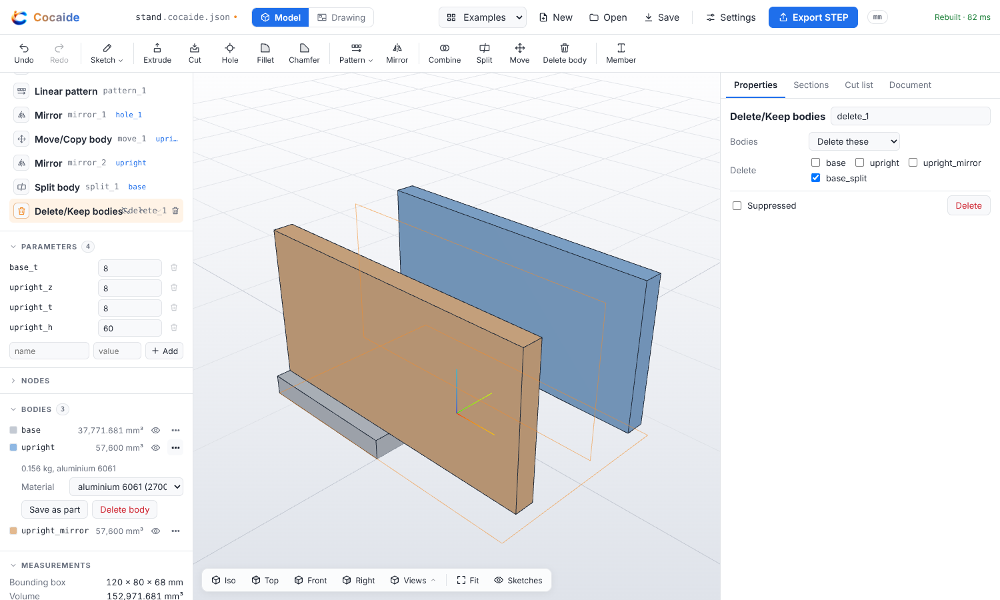

### Phase L: fabrication drawings

Open the example "table frame (weldment)", switch to **Drawing** and click **New drawing**.

| Check | Result |
|---|---|
| New drawing gives one A3 sheet, third-angle, with front, top and right views and an iso | Planned by code, at the largest standard scale that fits: 1:10. The top view sits above the front and the right view to its right, both lined up with it, as third-angle puts them; the iso goes top right. Hidden edges are off for a weldment, whose hollow sections would fill every view with dashes, and on for a plate. |
| It is dimensioned 1200, 600 and 900 | `d1` (front, `@left` → `@right`) reads 1200, `d2` (front, `@bottom` → `@top`) 900, `d3` (right view) 600. Each is measured on the projected part; no annotation takes a value. |
| Its balloons 1–3 sit on members of cut list items 1–3; the cut list and title block are on it | Each balloon names a member, and its number is that member's cut list item, worked out on every rebuild. The planner puts it on the member of its item the iso shows most of, and places it on the sheet near that member, clear of the others. The cut list table (item, size, length, ends, quantity, kg) sits above the title block. The title block has the name, steel (default), 23.98 kg, 1:10, A3, the date and the third-angle symbol. |
| The drawing checks pass | Every view shows the part. Every annotation is attached. Every cut list item has a balloon. The overall size is dimensioned in all three directions. Nothing overlaps or runs off the sheet. A part with holes adds "every hole is called out", and one with welds "every weld has a symbol". |
| Deleting a balloon fails "every cut list item has a balloon"; moving a view onto the title block fails the overlap check | Deleting `b5` gives "no balloon for item 2 (leg_a, leg_b, leg_c, leg_d)". Dragging the top view onto the title block holds it there (its `at`), the check names it, and the other views stay placed clear of it. **Place with the others** puts it back. |
| Switching every member to SHS 50×50×3 updates the sheet | In the model, **All like it** → SHS 50x50x3. Back on the sheet, a leg's length dimension reads 850 instead of 860, the cut list reads SHS 50x50x3, 2 × 1200, 4 × 850 and 2 × 600, the balloons still number items 1–3, and the checks still pass. |
| Right-click the front view and ask for the leg height | The scope is `view:front`, "view front and its annotations", and the model gets the drawing's tools and no others. The packet says where the view's nodes, members and holes are on the sheet, each member's cut list item, and whether it lies flat in the view. The proposal adds `{ "type": "dimension", "view": "front", "member": "leg_a" }`, previewed on the sheet with the five checks; accepted, it reads 860. An edit to a feature from that ask is refused: `writeScope: updateFeature "leg_a" is outside the scope [view:front]`. |
| The PDF opens in a PDF reader, and its text has the title, the dimensions and the cut list | Export PDF writes one A3 page, 1190.55 × 841.89 pt, every line a vector and every word Helvetica text. Poppler's `pdfinfo` and `pdftotext` read it, and the cut list comes out row by row. Export SVG is the SVG the app shows, word for word. |

These checks are covered at three levels:
- **Node** (`tests/drafting.test.ts`, `tests/drafting-ask.test.ts`):
  - validation, commands, scope, and renames that follow onto the sheet;
  - the projection against nodes and member ends;
  - the acceptance sheet and its checks, and the SHS 50 switch;
  - a plate's drawing, with its hole callout and positions;
  - the PDF through poppler;
  - the drawing ask with a scripted model: packet, scope, rollback, the correction pass, and a refused feature edit;
  - the MCP tools, with the log replayed.
- **Browser** (`e2e/drafting.spec.ts`): the acceptance flow above, with the API answered by a script.
- **Live** (`tests/phase-l-acceptance.test.ts`, with `ANTHROPIC_API_KEY`): the leg height from a right-click, against the real model.

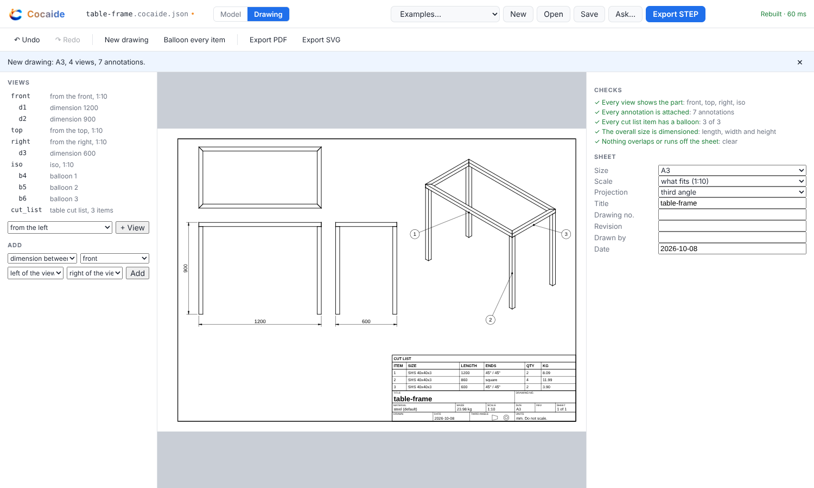

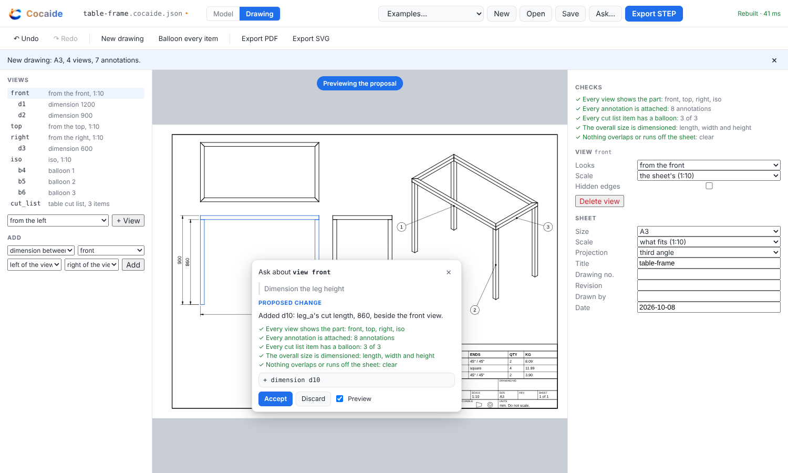

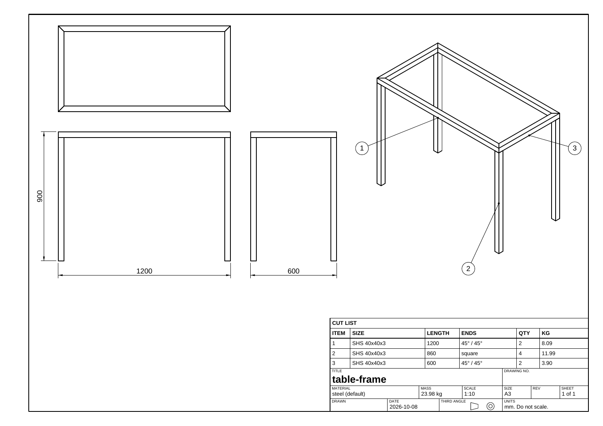

### Phase K: the agent on weldments

The section library holds the SHS drawn in Phase I, with the sizes 40 × 40 × 3 and 50 × 50 × 3. In a new part, right-click empty space and type "A 1200 × 600 table frame, 900 high, SHS 40×40×3".

| Check | Result |
|---|---|
| The table frame prompt builds after the card, from the library's profile | The model reads a frame: a table, 1200 × 600 × 900 outside, section "SHS 40×40×3", corners unspecified. The card shows the three sizes with the words they came from, and the section as **SHS 40x40x3, from the section library**. Corners is a blank, because the request doesn't say. Choose **Mitred**, then **Confirm and build**. The planner builds 8 members on nodes at the outside corners, mitred at the top, from a copy of the library's SHS (`"library": { "id", "version": 1 }`). The proposal reads "A 1200 × 600 × 900 mm table frame of SHS 40x40x3: 8 members, mitred corners. Checked against the request: 8 of 8 checks pass." Accepted, its cut list is 2 × 1200 (45°/45°), 4 × 860 (square) and 2 × 600 (45°/45°). |
| A section the library doesn't have is asked for, not guessed | Code finds the section's words in the request before it looks them up. A section the model names that the user didn't is a guess, and is blanked. "SHS 60x60x4" is not in the library: blank, with the library's sizes to choose from. "40x40x3" with two families of that size: blank, choose one. An empty library stops the request and says how to fill it. |
| The critic checks fabrication, and fails a loose member or a clash | On the built frame, each of these passes: every member connected, no clashes after trimming, no member longer than stock bar (6000 mm, or `stock_length`), and identical members grouped. Each fails when it should. A stray member gives "2 separate groups". Removing a corner joint gives three overlaps of 10,824 mm³. `stock_length` = 1000 flags the 1200 mm rails. One foot raised 0.2 mm gives "cut differently: … at 860 and leg_a at 859.8". |
| Right-click a butt joint and ask for a mitre | The joint's packet has its node, the members there and how each is cut, and the scope is the joint alone. **Mitre it** proposes `type: "mitre"` on it. Accepted, the rails are cut at 45° and the leg stops under them. An edit to another member from a member's right-click is refused by the scope. |
| In the profile card, Suggest fills the name, designations and tags | **✦ Suggest** sends the measured sizes (area, envelope, centroid, Ix/Iy, hollow or open) and nothing about the part. The reply fills the name "SHS", "SHS 40x40x3" and "SHS 50x50x3", and the tags, and says why. Every field stays editable, and a designation list that doesn't line up with the sizes is dropped. |

These checks are covered at three levels:
- **Node** (`tests/frame-ask.test.ts`): everything above, with a scripted model and the real kernel, plus butt corners and a flat rectangle.
- **Browser** (`e2e/frame-ask.spec.ts`): the prompt through the card to the accepted frame, the joint mitred from a right-click, and Suggest in the profile card, with the API answered by a script.
- **Live** (`tests/phase-k-acceptance.test.ts`, with `ANTHROPIC_API_KEY`): the frame prompt, a section not in the library, and Suggest, against the real model.

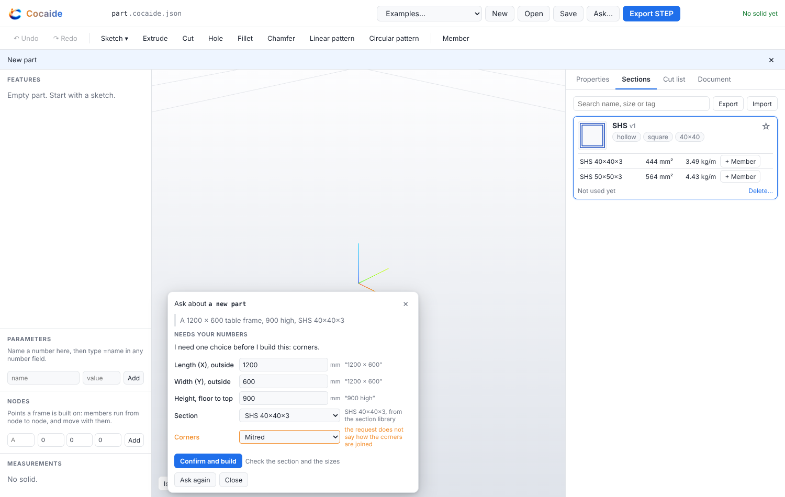

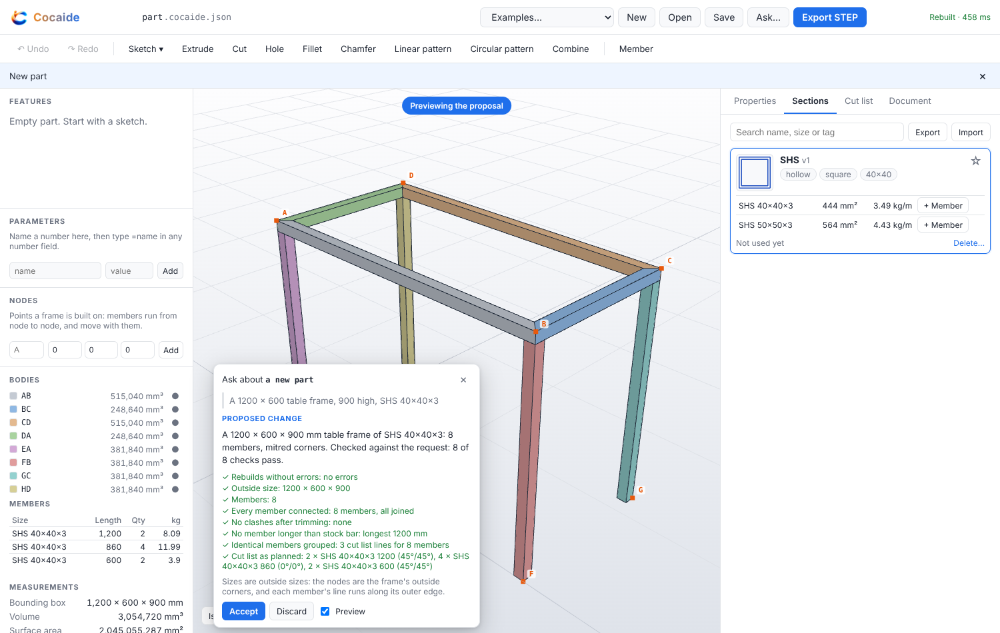

### Phase J: frames, joints and the cut list

The frame is built in the browser, in a new part. The SHS profile is drawn and saved to the section library as in Phase I, with the sizes 40 × 40 × 3 and 50 × 50 × 3.
1. The parameters are `frame_w` = 1200, `frame_d` = 600 and `frame_h` = 900.
2. The nodes are the frame's eight outside corners: A to D at the top (`[0, 0, "=frame_h"]`, `["=frame_w", 0, "=frame_h"]`, …) and E to H on the floor.
3. In **Nodes**, **Members along a path**, the path `A B C D A` of the library's SHS 40×40×3 makes the four rails, with the corners mitred. The path `E A, F B, G C, H D` makes the legs.

| Check | Result |
|---|---|
| The table frame builds with no interference between members | 8 members, 8 bodies, no overlap. The outside is 1200 × 600 × 900: with **Nodes on the outside**, each member's line runs along its outer edge (`"align": [-1, 1]` for the rails). The four mitres at the top cut the rails at 45°, and each leg stops under the two rails it meets. |
| The cut list's lengths and angles match the measured bodies | The cut list reads SHS 40×40×3: 2 × 1200 mm, 45° / 45°; 4 × 860 mm, square; 2 × 600 mm, 45° / 45°. It is measured on each trimmed body: its extent along its line, and the angle of each end face. The Node test checks it against the bodies another way: each body's extent along its axis is its length, and its volume is 444 mm² × its length at the centroid. For a rail that is 1200 − 2 × 20 = 1160 mm (515,040 mm³), because each 45° end takes 20 mm off. The CSV export is the same list. |
| Switching every member to SHS 50×50×3 rebuilds the frame and updates the cut list | Select a member, then **All like it** → SHS 50x50x3: all eight change as one undo step. The outside stays 1200 × 600 × 900, the legs become 850, and the cut list reads 2 × 1200, 4 × 850 and 2 × 600. That is 3,835,200 mm³ with no interference. One undo puts SHS 40 back. |
| (Also) FreeCAD opens the frame with each member named | `examples/table-frame.cocaide.json` ("table frame (weldment)") exports eight named solids. FreeCAD 26.3 imports them by name, with the same volume (3,054,720 mm³), area, faces and bounding box (`npm run verify:freecad`). |

These checks are covered at two levels:
- **Node** (`tests/frames.test.ts`):
  - the acceptance frame, and the cut list against the bodies;
  - SHS 50, and a wider table from one parameter;
  - butt joints with the through member extended, and gaps on butts and mitres;
  - joints that can't be made (in line, too sharp), and a suppressed member;
  - end caps (and one refused on a mitred end) and gussets;
  - validation of nodes, joints, caps and gussets;
  - node moves, renames and removals that what names them follows;
  - write scopes for nodes, parameters and joints;
  - the path builder;
  - the CSVs and the weld table.
- **Browser** (`e2e/frames.spec.ts`): the whole acceptance flow above from an empty part, and on the example: a weld at a joint (353.1 mm all round: 193.1 round the mitre face, 160 round the leg), a foot cap, a gusset, and a cap refused on a mitred end.

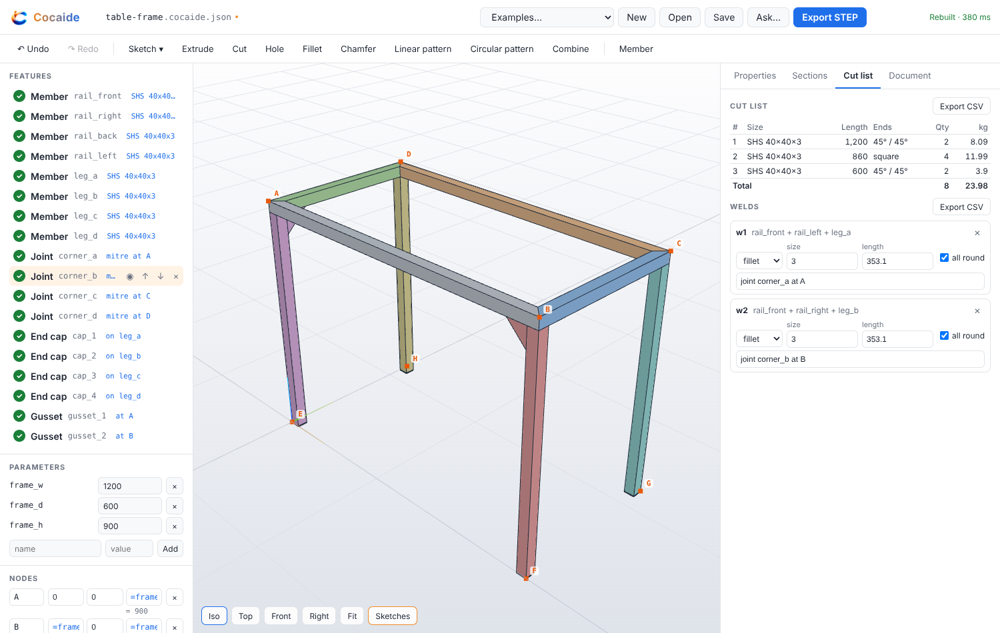

### Phase I: weldment profiles and the section library

The section is drawn in the browser, as a normal sketch: two rectangles centred on the origin, the outer one dimensioned `=b`, the inner one `=b - 2 * t`, with the part's parameters `b` = 40 and `t` = 3.

| Check | Result |
|---|---|
| Tick "Weldment profile" and finish: the card finds `b` and `t`, shows 444 mm² and 3.49 kg/m, and suggests "hollow" and "square" | The card says "Size parameters: b = 40, t = 3 (from the sketch's dimensions)". The first size reads 444 mm² and 3.49 kg/m (steel, 7850 kg/m³). The tags `hollow`, `square` and `40x40` are suggested and ticked. Ix = Iy = 101,972 mm⁴ about the centroid. |
| Add the size 50 × 50 × 3 and save: the profile is in the section library | The new row measures 564 mm² and 4.43 kg/m. The profile is re-solved at each size, so geometry drawn at 40 follows `=b` to 50. Saved, **Sections** shows SHS v1 with both sizes, and the sketch is marked as the profile (`"profile": { "name": "SHS", "library": { "id", "version": 1 } }`). Searching "hollow 50x50" finds it, and "channel" doesn't. |
| In another part, a 900 mm member of SHS 40×40×3 and a 600 mm member of SHS 50×50×3: each is its own body with the right volume, and the members are listed with their lengths | **+ Member** puts a copy of the profile in the part and adds the member, as one undo step. Set the lengths to 900 and 600. `member_1` is 399,600 mm³ (444 × 900) and `member_2` is 338,400 mm³ (564 × 600), with no interference. The members list reads SHS 40×40×3, 900 mm, 1 off, 3.14 kg; and SHS 50×50×3, 600 mm, 1 off, 2.66 kg. |
| Clear the library: the part still opens and rebuilds from its own copy | Delete SHS from **Sections** and reload the page. The part rebuilds to 738,000 mm³ from `profiles.SHS` in its own document. |
| (Also) STEP keeps member names, and FreeCAD opens them | `examples/frame-members.cocaide.json` ("members (weldment)") exports `leg` and `rail`. FreeCAD 26.3 imports both by name, with the same volume (738,000 mm³), area and bounding box (`npm run verify:freecad`). |

These checks are covered at two levels:
- **Node** (`tests/weldment.test.ts`):
  - section properties (an SHS, an angle's centroid, a round tube), the suggested tags, and re-solving a drawn profile at another size;
  - profile and member validation, including a member of a broken profile, which points at that profile's errors;
  - members as bodies: upright and centred, rotated, anchored on the sketch origin, patterned (`leg`, `leg_2`), renamed, and grouped like a cut list;
  - the library: making a profile from a sketch, versions, search order, export and merge;
  - a part's copies: kept while they have the size, brought up to date when a member needs a new size, and refused when an update would drop a size in use.
- **Browser** (`e2e/weldment.spec.ts`): the whole acceptance flow above, the toolbar's **Member** (another like the last, undone with its copy in two steps), and editing a profile sketch, which keeps `=b` and saves version 2.

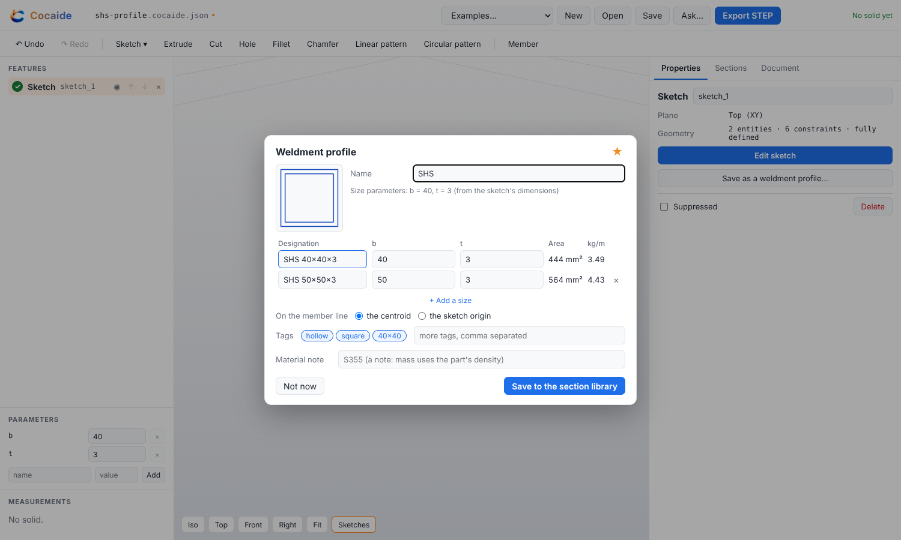

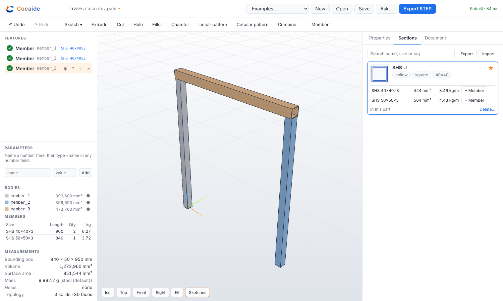

### Phase H: multibody parts

The example is `examples/stand.cocaide.json` (in **Examples** as "stand (two bodies)"). It is a 120 × 80 × 8 base plate with two Ø10 holes, and a 120 × 8 × 60 upright plate standing on it, as two bodies.

| Check | Result |
|---|---|
| A part of two bodies rebuilds as two named solids, each measured, with no interference | `base` is 75,543.363 mm³ and `upright` is 57,600 mm³. They touch, so the overlap check reports nothing. Each is its own solid: 2 solids, 14 faces. |
| Pushed 2 mm into the base, the overlap is reported in mm³ | Set `base_t` to 10. The upright still stands at `upright_z` = 8, so the rebuild reports "base and upright overlap by 1,920 mm³" (120 × 8 × 2). Set it back, and the warning goes. |
| A hole scoped to the base leaves the upright whole | `hole_1` has `"bodies": ["base"]`. The upright stays exactly 57,600 mm³. The same hole with no list, drilled from the upright's top face, goes through both bodies. A listed body that loses nothing is an error: `hole_1: removed no material from body "upright"`. |
| STEP exports two named solids, and FreeCAD opens them by name | The STEP is an assembly `stand` with components `base` and `upright` (XCAF). FreeCAD 26.3 imports objects `base` and `upright`, with the same volume, area, faces and bounding box as Cocaide (`npm run verify:freecad`). A one-body part exports exactly as before. |
| Combine merges them into one body whose volume is the sum | **Combine** adds `upright` into `base`: one body, one solid, 133,143.363 mm³. A later feature that names `upright` is rejected, because the upright no longer exists. Subtract and common work too, and common of two bodies that only touch is an error. |
| Each body has its own colour and can be hidden; a right-click asks about that body only, and the API rejects an edit to the other | The **Bodies** panel lists each body with its colour, volume and an eye to hide it. Right-click `upright`: the scope is `ext_2` plus new features on `upright` alone. When the scripted model tries to drill the base, the API returns `writeScope: addFeature … is outside the scope [ext_2, body:upright]`, and the document is unchanged. |

These checks are covered at two levels:
- **Node** (`tests/bodies.test.ts`): everything above, plus:
  - patterns of a new body (`foot`, `foot_2`, `foot_3`);
  - selectors that name a body;
  - name errors at validation;
  - `renameBody`, including renaming the default `main`;
  - the body ask packet;
  - the measurement summary the agent reads.
- **Browser** (`e2e/bodies.spec.ts`): the bodies panel, hiding a body, the overlap warning, the hole's body checkboxes, the STEP download, Combine, and the body ask with the API answered by a script.

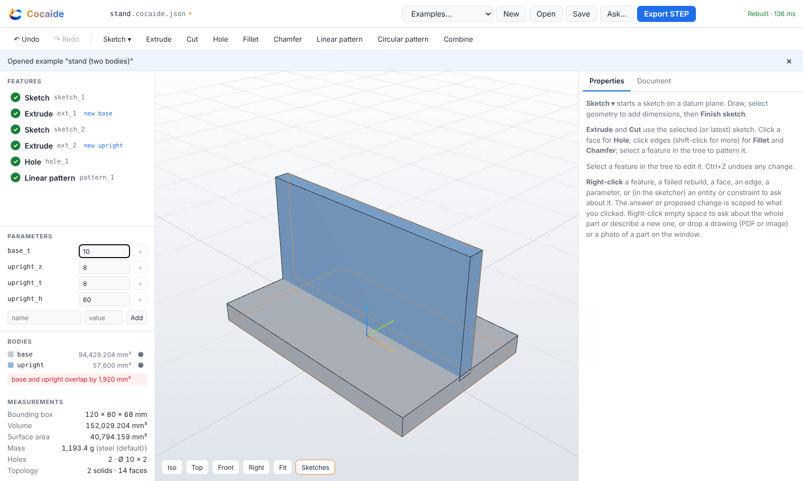

### Phase G: photo underlay

The fixture is a photo of the spec bracket from above, on a workbench with a steel rule beside it (`examples/photos`, made by `npx tsx scripts/make-photos.ts`). It is drawn so that every edge's pixel position is known: the plate spans 640 × 320 px, and the rule's 0 and 100 mm marks are 800 px apart. A second photo shows a freeform moulded part.

| Check | Result |
|---|---|
| The system refuses to export STEP until the user has confirmed the scale dimension | Drop `bracket-photo.jpg` and type "the long edge is 80 mm". The app guesses the image is a photo, and the user can switch it to a drawing. The model reads the outline and the hole in pixels. Code scales them from the typed 80 mm to give 80 × 40, Ø6.6 at (70, 20), and builds the plate. The thickness is a guess (4 mm), because a photo from above doesn't show it. The proposal is previewed over the photo. Once accepted, the photo stays pinned under the part, and Parameters marks each size as the scale, "≈ photo" or a guess. **Export STEP** is refused, with the reasons: "its scale is not confirmed … and part_t is a guess". Setting the thickness to 6 still leaves export refused. The user then picks the rule's 0 and 100 marks on the photo and types 100. Every estimate rescales with the scale; the thickness, which the user set, does not. The part is 18,994.728 mm³, the spec bracket. **Confirm scale** turns the line green, and only then does STEP export. Its header says the part was estimated from a photo, scaled from one dimension the user confirmed. |
| A freeform part is refused | `freeform-photo.jpg` is refused with "This looks freeform … Cocaide builds prismatic and turned parts; model this one by hand, with the photo for reference." Nothing is built. |

These checks are covered at three levels:
- **Browser** (`e2e/photo.spec.ts`): the photo is prepared and stored in the page, the real SDK sends it, and the API is answered by a script. The test clicks the rule's marks on the pinned photo and downloads the STEP. It also checks that the photo is found again after a reload, and that a browser without the photo shows which one to drop to pin it again.
- **Node** (`tests/photo.test.ts`): the same logic with scripted readings, plus:
  - a rule in the photo as the scale;
  - a typed number that isn't in the note becoming a guess;
  - a guessed scale that can't be confirmed as it is;
  - a disc's holes placed from its centre;
  - an agent refused the confirmation, even with `*` scope;
  - the agent session refusing STEP and STL, then writing the header note.
- **Live model** (`tests/phase-g-acceptance.test.ts`): runs both checks against Claude when `ANTHROPIC_API_KEY` is set. **No key was available where this was built, so the live-model tests for Phases D–G have not been run yet.**

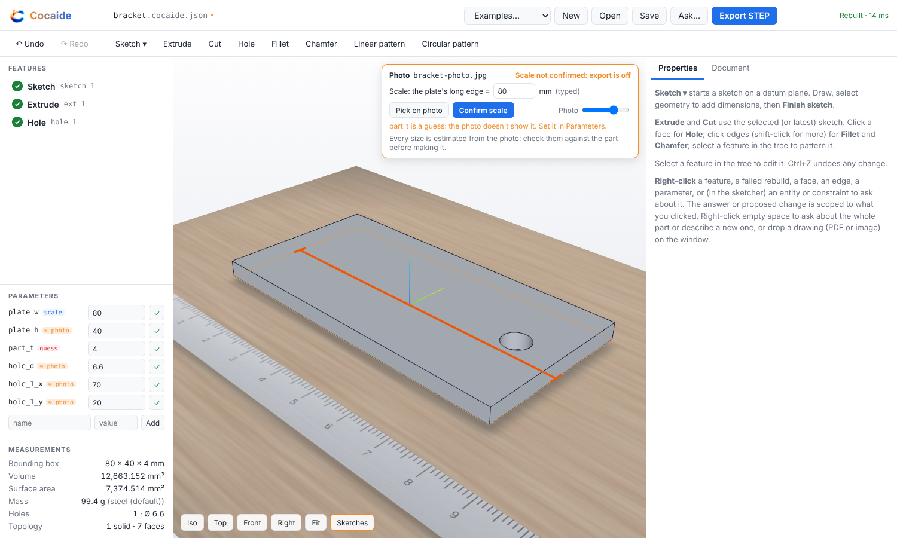

### Phase F: drawing ingest

The fixtures are a real dimensioned drawing of the spec bracket (`examples/drawings`, made by `npx tsx scripts/make-drawings.ts`): a vector PDF printed by Chromium, a clean 200 dpi scan, and a blurry scan. The drawing shows a top view and a front view, dimensions 80, 40, 6, 70 and 20, the callout "Ø6.6 THRU", and a title block: BRACKET, CD-0001, S275 STEEL, mm, third angle.

| Check | Result |
|---|---|
| A clean one-part dimensioned PDF of the bracket lands in the confirmation card with the right numbers, and builds after confirm | Drop `bracket.pdf` on the window. pdf.js rasterises the page at 200 dpi (2339 × 1655) and extracts its text layer, and both go to the model. The card shows 80, 40, 6, Ø6.6 at (70, 20), mm, third angle, BRACKET, CD-0001 and S275 STEEL, each with its quoted evidence and confidence, and no blanks. Nothing is built until **Confirm and build**. The planner then builds `sketch_1`, `ext_1` and `hole_1`, and the critic passes 6 of 6 checks. Accept, and the part is 18,994.728 mm³, the spec bracket. It is named BRACKET, and the drawing, projection, units, drawing number and material are stored in `source`. |
| A blurry drawing leaves fields blank rather than inventing them | Drop `bracket-blurry.png`. Its legibility is measured on the pixels: 2%, against 100% for the clean scan. The ask says it looks too blurry before anything is sent. The scripted model returns a confident, complete reading anyway. Every number, the units, the projection and where the holes go come back blank, with "the drawing is too blurry to read this", and Build stays disabled. Filled in from the paper copy, it builds. |

These checks are covered at three levels:
- **Browser** (`e2e/drawing.spec.ts`): the real PDF goes through pdf.js in Chromium, legibility is measured on the real pixels, and the real SDK runs with the API answered by a script. The test checks what the page sent: the 200 dpi PNG, the text layer, and a JSON-schema output format. It also opens the drawing full size from the card.
- **Node** (`tests/drawing.test.ts`): the same logic with a scripted reading, plus:
  - a misread number that is not printed on the PDF ("6.5 is not printed on the drawing");
  - legibility thresholds (a box blur of radius 3 still reads, radius 4 does not);
  - a clean scan with no text layer, read at the model's confidence;
  - the v1 limits: one part per drawing, plates and discs only;
  - an inch drawing, converted once.
- **Live model** (`tests/phase-f-acceptance.test.ts`): runs both checks against Claude when `ANTHROPIC_API_KEY` is set (not yet run: see Phase G).

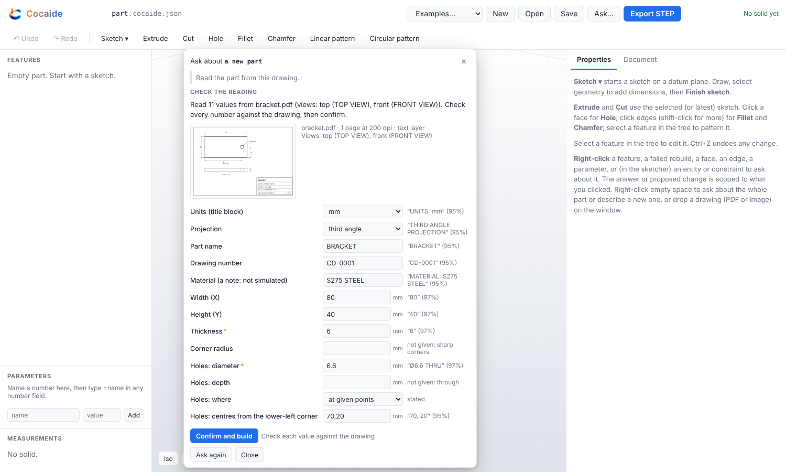

### Phase E: part-level prompt

| Check | Result |
|---|---|
| "80 x 40 x 6 plate, four 6.6 holes 8 mm from corners" produces the plate without a human fix | Right-click empty space and type the request. Every number is in the request, so there is nothing to ask. The planner builds `sketch_1` (80 × 40, fully defined), `ext_1` (6) and `hole_1` (Ø6.6, 8 mm in from both edges), plus a 2 × 2 `pattern_1`. Their sizes are parameters `plate_w`, `plate_h`, `part_t`, `hole_d` and `hole_inset`. The critic passes 6 of 6 checks: rebuilds, one solid, 80 × 40 × 6, 4 holes, Ø6.6 each, centres at (±32, ±12) through 6 mm. Accept, and the part is 18,378.913 mm³. |
| "a plate with some holes" asks instead of guessing | The result is **Needs your numbers**, with blanks for width, height, thickness, hole diameter, where the holes go, and how many. Nothing is built until they're filled. The check is in code: when a scripted model *invents* 80 × 40 × 6 with Ø6.6 holes and calls them stated, each comes back as "80 is not in the request" and is still a blank. |

These checks are covered at three levels:
- **Browser** (`e2e/part.spec.ts`): the real SDK with the API answered by a script, filling the card through to a built part. It also covers a question about the whole part.
- **Node** (`tests/part-ask.test.ts`, `tests/intent.test.ts`): runs the same logic with a scripted model, plus:
  - M6 standard sizes;
  - inch conversion;
  - grid, circle and point patterns;
  - the critic catching a wrong part;
  - the single correction pass.
- **Live model** (`tests/phase-e-acceptance.test.ts`): runs both checks against Claude when `ANTHROPIC_API_KEY` is set. **No key was available where this was built, so the live-model tests for Phases D and E have not been run yet.**

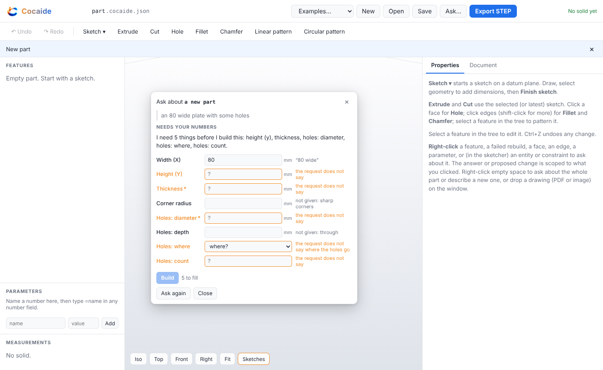

### Phase D: right-click ask

| Check | Result |
|---|---|
| Right-click `hole_1`, "make it 8 mm", changes that diameter only | The packet is `hole_1` with parent `ext_1`, no children, measured Ø6.6 × 6 deep, and write scope `[hole_1]`. The proposal lists exactly `hole_1 diameter: 6.6 → 8`, and the viewport previews it at 18,898.407 mm³. Accept writes it as one undo step; every other feature is byte-identical. |
| Right-click a sketch entity, "pattern the part", is refused as out of scope | The scope is `sketch_1/r1`, meaning r1 and the constraints on it. The model's `addFeature` comes back as `writeScope: addFeature "linearPattern_1" is outside the scope [sketch_1/r1]`. The ask ends as **Out of scope** with nothing to accept, and the document is unchanged. |
| "What is this face" returns text and does not write | A question is explain-only. The model is offered no write tools at all: only `measure`, `getFeature` and `escalate`. It gets one picture, framed on the face with the face outlined. The ask ends as **Answer**, with no proposal, and the document is unchanged. |

These checks are covered at three levels:
- **Browser** (`e2e/ask.spec.ts`): the page runs the real Anthropic SDK. Playwright answers its calls to `api.anthropic.com` with scripted Messages API responses and records what the page sent: the packet, the tools offered, and the user's words last and unchanged.
  - The same file also covers the conflict rule (a user edit drops the open proposal and keeps the prompt) and "fix this error" with apply-immediately.
- **Node** (`tests/ask.test.ts`): runs the same logic with a scripted model, plus:
  - rollback inside an ask;
  - the one-correction-pass limit;
  - the one-feature rule for faces and edges;
  - reads limited to what the packet names.
- **Live model** (`tests/phase-d-acceptance.test.ts`): runs the three checks against Claude when `ANTHROPIC_API_KEY` is set. **No key was available where this was built, so it has not been run against the live model yet.**

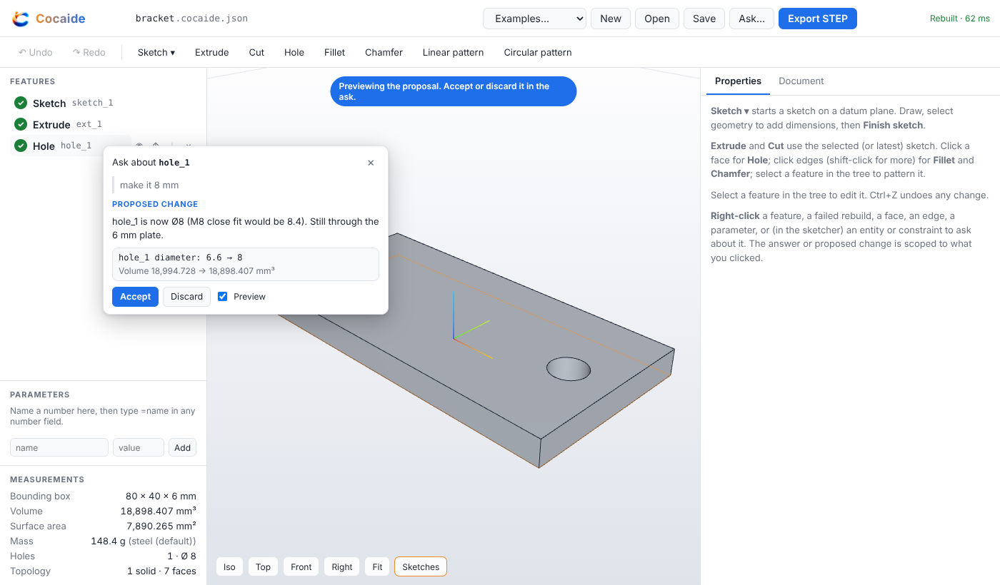

### Phase C: agent tools

| Check | Result |
|---|---|
| Scripted tool calls build the bracket with zero UI | A client starts the real server over stdio on a new file with scope `+`, then calls `addFeature` three times (sketch, extrude, hole). Volume 18994.728336 mm³; `validate` is clean. The file the server saved is `examples/bracket.cocaide.json` byte for byte |
| A bad diameter returns the error string and leaves the document unchanged | `updateFeature hole_1 {diameter: -2}` → `updateFeature rejected: hole_1: diameter: must be greater than 0 (got -2)`. `{diameter: 500}` is valid by the schema but breaks the part, so the transaction rolls back: `updateFeature rolled back: hole_1: removes all the material: nothing of the part would be left`. In both cases the file, the revision and the volume are unchanged |
| A tool call aimed at `ext_1` while scope is `hole_1` is rejected | `updateFeature ext_1` → `writeScope: updateFeature "ext_1" is outside the scope [hole_1]`; so are `deleteFeature ext_1` and `setParameter plate_t` (ext_1 uses it). The file is untouched, and `updateFeature hole_1` still goes through |
| The agent can add a hole, change a parameter, export STEP, take an iso screenshot | `addFeature` of a second hole; `setParameter plate_t` 6 → 10 with `ext_1.distance = "=plate_t"` (31,315.761 mm³), and `undo` back to 6. `exportSTEP` writes `bracket.step`, which OCCT reimports at the same volume and FreeCAD 26.3 opens as one valid solid named `bracket`. `screenshot iso` returns one 800×600 PNG |
| Every agent command is logged next to its revision | The JSONL log starts with the full document; replaying it reproduces every revision hash and the final file |

That suite is `tests/phase-c-acceptance.test.ts`; it drives `src/mcp/server.ts` through the MCP SDK client. The FreeCAD check runs when `FREECAD_CMD` is set. `tests/agent-session.test.ts`, `tests/scope.test.ts` and `tests/parameters.test.ts` cover the rest.


### Phase B: human modeller

| Check | Result |
|---|---|
| A human makes the bracket with no JSON editing | In the browser: New → Sketch on Top → draw a rectangle → select it, type width 80 and height 40, centre it on the origin (the sketch reads "Fully defined") → Finish → Extrude, depth 6 → click the top face → Hole, centre 30, 0, diameter 6.6. Volume 18,994.728 mm³. The document those clicks produce is the spec's bracket, the face selector included (`planar, normal +Z, pick largest`) |
| Undo returns the previous solid | Undo walks back one edit at a time (diameter, centre, the hole itself) to the 19,200 mm³ plate; redo walks forward to the bracket again |
| A bad selector shows the error, not a crash | Fillet the hole rim by clicking it, then make the hole smaller: the fillet row reads `edges: selector matched 0 edges (wanted circle edges radius 3.3 on the planar face normal +Z)`, the rest of the part still rebuilds, STEP export is refused, and undo clears it |
| The bracket built in the browser opens in FreeCAD | The STEP the **Export STEP** button downloaded opens in FreeCAD 26.3 as one valid solid named `bracket`, 18994.728336 mm³ |

These are `e2e/phase-b-acceptance.spec.ts`. `e2e/modelling.spec.ts` covers the rest: editing a sketch dimension, cancelling a sketch, line chains that close themselves, circles, arcs and slots, sketch on a face, suppress, drag-to-reorder, refused moves and deletes, fillet and chamfer by picking edges, linear and circular patterns, and the JSON tab.


### Phase A: document and kernel

| Check | Result |
|---|---|
| The spec's bracket JSON rebuilds | `examples/bracket.cocaide.json` is the spec's JSON verbatim; 3/3 features rebuild, no errors |
| Volume matches hand calc within 0.1% | 80×40×6 − π·3.3²·6 = 18994.728336 mm³; kernel gives 18994.728336 (difference below 1e-10 mm³) |
| STEP reimports | Exported STEP read back by OCCT: valid, 7 faces, same volume |
| STEP opens in FreeCAD | Every example (bracket, mounting plate, flange) opens in FreeCAD 26.3 as one valid solid; volume, area, face count and bounding box match Cocaide to 1e-6 |
| Selector survives a thickness change | Plate thickness 6 → 10 (and → 3): `hole_1`'s selector still resolves to the top face, the hole is still through, volume matches the new hand calc |

That suite is `tests/bracket.acceptance.test.ts`. FreeCAD verification is `scripts/verify-freecad.ts`; it needs a FreeCAD install, which is not a project dependency.

## Modelling in the browser

- **Units.** Millimetres (metric) throughout, and only millimetres: every length field says mm, every angle °, masses are in g or kg, and the `mm` badge in the top bar and **Settings → Units** say so. Parts are stored in millimetres.
- **The toolbar** has a picture over each tool's name, in groups: Sketch; Extrude, Cut, Hole, Fillet, Chamfer; Pattern (linear or circular) and Mirror; the body tools (Combine, Split, Move, Delete body); and Member for weldments. A tool that needs something it doesn't have yet (Combine with one body) is greyed out and says why. The feature tree shows the same picture for each feature. The left column's sections fold under their headings; **Nodes** starts folded on a part without nodes.
- **Mouse, as in SOLIDWORKS.** Middle-drag rotates (freely, no fixed up), Ctrl+middle-drag pans, Shift+middle-drag zooms, Alt+middle-drag rolls. Middle-click the part and the next rotation turns about that point; a middle double-click fits. The wheel zooms at the pointer, rolled toward you to zoom in. Left-click selects (Ctrl- or Shift-click adds); right-click asks; right-drag pans. In a sketch, middle-drag pans and a left-drag on empty space draws a selection box: left to right takes what is wholly inside it, right to left everything it touches. **Settings → Mouse** has a trackpad scheme (left-drag rotates, Shift+drag pans, pinch zooms) and reverses the wheel.
- **Keyboard, as in SOLIDWORKS.** Ctrl+1 to Ctrl+7 are Front, Back, Left, Right, Top, Bottom and Isometric; Ctrl+8 is Normal to the selected face (again, from behind). F fits, Z and Shift+Z zoom, the arrows turn the view 15° (Shift: 90°, Ctrl: pan, Alt: roll), Space opens the view menu, S brings the tools to the pointer, Enter repeats the last tool, Delete deletes the selected feature, F9 hides the left column, Ctrl+S saves, Ctrl+O opens, Ctrl+Z and Ctrl+Y undo and redo. In a sketch: V select, L line, R rectangle, C circle, A arc, O slot, Q construction, Ctrl+B finishes. **Settings → Keyboard** lists every command: click one and press a key to change it (a command that had that key loses it), Backspace to clear it; the model tools have no key until you give them one. The settings are kept in this browser, and **Reset to SOLIDWORKS defaults** puts them back. Ctrl+N, Ctrl+T and Ctrl+W belong to the browser.
- **Sketch** starts a sketch on the Top, Front or Right plane, or on a flat face you clicked. Draw with Line (clicks chain; clicking the first point closes the loop), Rectangle, Circle, Arc (centre, start, end) and Slot (two centres, then the width). Points snap to existing points, which adds a coincident constraint, or else to the grid.
- Select geometry to see the constraints that fit it, valued at what the geometry measures now; type a new value and the solver moves the sketch. Drag points, corners, circle edges or whole entities, and the solver keeps every constraint. The panel shows the degrees of freedom left and whether the profile is closed. **Finish** turns the session into one undo step.
- **Extrude** and **Cut** use the selected or latest sketch. A new cut points into the material. Click a flat face, then **Hole**: the hole is placed where you clicked. Click edges (shift-click for more), then **Fillet** or **Chamfer**. Select an extrude, cut or hole in the tree, then **Pattern → Linear pattern** or **Circular pattern**.
- Picks become selectors that are checked to find exactly what was clicked. The most robust form is preferred, such as "the largest face facing +Z" or "the edge between this face and that one". Four picked corners become "straight edges parallel to +Z". Position (`near`) is used only when nothing else tells two faces or edges apart.
- In the tree, select a feature to edit it in the Properties panel. Each field commits on Enter or blur as one command. You can also suppress, move up or down, drag to reorder, and delete. Moves that break a reference are refused and the notice says why.
- Ctrl+Z / Ctrl+Shift+Z undo and redo any change to the document. Inside a sketch they undo sketch edits. The Document tab is the same document as JSON.
- **Parameters** (left panel) are named numbers. Type `=plate_t` or `=plate_t * 2 + 1` in any number field; the field shows what it evaluates to, and a bad expression is shown and not committed. Changing a parameter is one undo step, and sketches whose dimensions use it are re-solved. The sketcher works on numbers but keeps every expression whose value you did not change.
- **Frames.** **Nodes** (left panel) are named points; type `=frame_w` in a coordinate to tie it to a parameter. With two nodes or more, **Members along a path** takes a size (the part's or the library's) and a path such as `A B C D A, A E`. It adds the members along it with their corners mitred, with the nodes on the outside of the frame or on the centrelines. A member's Properties set its ends (a node or a point), the point of the section its line runs through (a 3 × 3 grid, seen from its To end), and **All like it**, which switches every member of that size at once. They also cap either end. A joint's Properties change mitre or butt, which members, and the gap, and add a gusset or a weld there. The **Cut list** tab is the cut list and the weld table, each with **Export CSV**.
- **Weldments.** A dimension in the sketcher can be typed as an expression too (`=b - 2 * t`), and it stays one. Tick **Weldment profile** and **Finish**: the profile card names the section, lists its sizes with their area and kg/m, and tags it, and **Save** puts it in the **Sections** tab. "Not now" keeps the sketch; its Properties have **Save as a weldment profile…** for later. In **Sections**, **+ Member** on a size adds a 1000 mm member along X beside the others. Set its ends, length or rotation in Properties. The toolbar's **Member** adds another like the selected one. The **Bodies** panel lists the members, with alike ones counted together, and a newer library version offers to update the part's copy.

## Right-click ask

Right-click any of these to ask about it:
- a feature in the tree (a sketch counts as a sketch);
- a failed rebuild row;
- a face or an edge in the viewport;
- a parameter;
- in the sketcher, an entity or a constraint row.

The menu is labelled with the target ("Ask about hole_1"). Under the prompt box are scoped actions such as *Hole here*, *Fillet this edge*, *Fully define this sketch*, *Fix this error*, and for a weldment *Mitre it* (a joint) or *Swap its size* (a member). Each is a prompt with the intent already filled in; the ones that need a number put the text in the box for you to finish. Right-click empty space to ask about the whole part (see below).

**The packet is the prompt** (`src/ask/packet.ts`). It holds:
- the target node, its parent and its direct children;
- the target's own measurements (for a hole, its measured diameter and depth);
- the selector for a picked face or edge;
- the error, if the feature failed;
- the parameters the target uses;
- for a member, the sizes its profile has in this part and its measured cut; for a joint, its node and the members there;
- the write scope.

The user's text comes last, unchanged. A visual prompt ("what is this face", "make it look like…") adds one image, framed on the target and outlined.

**Scope** (`src/ask/packet.ts` → `scopeFor`, enforced by `apply`):

| Right-click | May change |
|---|---|
| Sketch entity or constraint | that entity, and constraints on it (`sketch_1/r1`) |
| Sketch | its entities and constraints, not the feature or what uses it (`sketch_1/*`) |
| Feature | its fields, or a new child that references it (`hole_1`) |
| Face or edge | one new feature that uses that face or edge (a hole drilled into it, a fillet of it, or a sketch on it with its cut); the feature that made the face is untouched |
| Failed rebuild | the feature named in the error |
| Parameter | that parameter |

**Cheap before smart.** The agent answers if the packet is enough. Otherwise it changes one field, then makes a scoped edit, and if none of those fit it escalates ("cannot be done from here"). A question gets no write tools, so it cannot write.

Edits run in a sandbox copy of the document. Each one is a checked transaction, kept only if nothing newly fails. The agent gets one correction pass after it sees the result. What comes back is a **proposal**: the list of changes down to the field, and volume before and after, previewed in the viewport. Accepting it replays the agent's commands on your document as it is then, as one undo step. **Apply immediately** (per prompt, off by default) accepts it as soon as it checks out.

If you edit a feature the open proposal touches, the proposal is dropped and your prompt is kept (spec 6.4).

Every ask is logged in the browser next to the revisions it produced:
- the target, prompt and model;
- each tool call with the sandbox revision and hash after it;
- whether the proposal was accepted, and the hash of what was accepted.

**Settings → Download ask log** saves it as JSON Lines.

**Model.** The default is Claude Opus 5.5 at low effort; Sonnet 5.5 and Haiku 4.5 can be chosen under **Settings**. The SDK is loaded on the first ask, not with the app. What leaves the machine is the packet, plus the one framed image for a visual prompt. Modelling and STEP export never need a key.

## The part-level prompt

Right-click empty space, or drop a drawing (PDF or image) or a photo on the window. This target is the whole part, the weakest scope, so the result is always a proposal; there is no "apply immediately" here (spec 6.2).
- A question about the part is answered from a packet of the whole part: each feature in one line with its status, the parameters and the measurements. It gets no write tools.
- A change to the existing part runs the ordinary ask with scope `*`.
- A new part goes through intent (spec 5.1).

**Intent** (`src/intent/schema.ts`). The model reads the request (and the drawing) into intent JSON as structured output, for example a plate with hole groups at corners, centre, grid, points or on a circle. Each number is `{ value, evidence, source, confidence }`, where source is `stated`, `standard` (M6 → 6.6), `inferred` or `missing`. The model never converts units.

**Ask if missing** (`src/intent/review.ts`). This is enforced in code, not left to the prompt:
- A number marked stated must actually appear in the request; otherwise it is a guess.
- `standard` is accepted only when the evidence names a metric size whose clearance hole or tap drill gives that value.
- Thickness and hole diameter are ask-first: a guess is never used.
- Anything the part needs that is missing, guessed or under 0.8 confidence becomes a blank in the confirmation card. What the user typed is used exactly.
- A number read from a drawing must be printed in the PDF's text layer. A scan has no text layer, so its numbers are trusted at 0.8 confidence or above, and none are trusted from a blurry one (see [Drawing ingest](#drawing-ingest)).

**Plan, rebuild, criticise** (`src/intent/plan.ts`, `src/intent/critic.ts`).
- The planner is deterministic. A request in inches is converted once, and the conversion is reported.
- Its output is parametric: the user's numbers become document parameters, and the holes are expressions over them. A wider plate keeps its holes 8 mm from the corners.
- The critic reads the rebuilt part's measurements, not the plan: size, solid count, hole count, diameters, and each hole's centre and depth.
- If anything disagrees, the agent gets one correction pass with the findings. Then the part goes back to the human, with the checks on the proposal.
- A part that is not a plate or a disc is built by the agent from the confirmed description.

**Frames** (Phase K: `src/intent/frame.ts`, `src/weldment/fabrication.ts`).
- A frame's intent is its type (`table` or `rectangle`), its outside length, width and height, the section as the user wrote it, and its corners.
- The review finds the section's words in the request, then matches them against the section library and the part's own copies. Words differ only in spacing, "×" or "by". Numbers in a named family also match. Only one match fills the card.
- The card is always shown, and **Confirm and build** is the confirmation.
- The planner builds it like Phase J's path tool: parameters `frame_w`, `frame_d` and `frame_h`; nodes at the outside corners; members with the nodes on the outside; and mitre or butt joints (the legs run through on a table). It expects the cut list from the section's envelope.
- The critic checks the size, the member count, the fabrication checks and the planned cut list. The fabrication checks are also in the part packet of any part with members, so "Check it" from empty space answers with them.

Accepting a new part replaces the document, as one undo step. Any edit to the document while the proposal is open drops it.

## Drawing ingest

Drop a PDF or an image (PNG, JPEG, WebP, GIF; up to 20 MB) on the window. This opens the part-level ask with the drawing attached; a note typed with it goes along, but none is needed (spec 5.2).

1. **Rasterise** (`src/drawing/rasterize.ts`, in the browser). pdf.js renders each page at 200 dpi, up to 3 pages, and extracts the text layer. An image is used at its own resolution, flattened onto white. pdf.js and its worker load only when a PDF is dropped.
2. **Measure legibility** (`src/drawing/legibility.ts`). This is computed from the pixels, not judged by the model. It combines the contrast between paper and ink with how much of the ink is solid rather than smeared grey. Under 50% the drawing is too blurry to read, and the ask says so before anything is sent.
3. **Read** (`src/intent/drawing.ts`, `DRAWING_SYSTEM` in `src/ask/part.ts`). The pages go to the model as images, with the text layer "exactly as printed on the sheet". It returns structured output only:
   - the views found (top, front, side, section, detail);
   - the projection, the title block's units, the part name, the drawing number and the material;
   - notes, such as thickness notes;
   - the part as intent: overall sizes and hole callouts.

   Every field is `{ value, evidence, source, confidence }`, where evidence is the quoted text or "inferred". The top view gives the outline and the holes; a front, side or section view or a thickness note gives the thickness. The model is told not to invent geometry no view shows.
4. **Confirm** (the card). The card is always shown, with the page (click it to open full size), the views found, and each value with its evidence. A value is a blank the user fills when:
   - it is missing, inferred or under 0.8 confidence;
   - on a PDF, the number is not in the text layer;
   - the drawing is too blurry, in which case nothing read from it is used, not even where the holes go.

   The units and the projection are required. If the sheet doesn't state them, the user declares them. **Confirm and build** is the user's confirmation of everything on the card.
5. **Build.** The confirmed reading goes through the same planner, critic and single correction pass as a typed request. Numbers are in the title block's units and are converted once. The result is a proposal to accept.

v1 limits:
- One part per drawing. A sheet showing more gets a message on the card, and Build stays disabled.
- Flat plates and discs: one outline with holes through it. For anything else the card says to build it by hand or describe it.
- No GD&T solver. Tolerances are not read into the part.
- The projection is stored. v1's flat parts read the same in either projection, because only the arrangement of the views differs.
- The material note is stored in the document's `source`, never simulated: mass still uses the document's `material` density.

## Photo underlay

Drop a photo of a part (JPEG, PNG, WebP, GIF). An image could be a drawing or a photo, so the ask offers both, with a guess made from the pixels: a drawing is mostly bright, colourless paper. Type one size you know, such as "the long edge is 80 mm", or leave it blank (spec 5.3).

1. **Prepare** (`src/photo/prepare.ts`, in the browser). The photo is scaled to at most 1568 px on its long side. Every model in the picker reads that size without resizing it, so the pixel positions the model gives are the photo's own. The pixels are kept in this browser's IndexedDB under the file's SHA-256 (`src/photo/store.ts`). The document names the photo but never holds it.
2. **Read** (`src/intent/photo.ts`, `PHOTO_SYSTEM` in `src/ask/part.ts`). Structured output, in pixels:
   - prismatic, turned, freeform or not a part;
   - face-on or oblique;
   - the outline's box and each hole's centre and diameter;
   - the thickness, only where an edge is seen side-on;
   - the scale: the size the user typed, else two marks on a reference in the photo (a rule), else a guess at the long side.
3. **Scale and plan** (code, not the model). Millimetres per pixel come from the one dimension. A typed length must be in the user's note, or it becomes a guess. Each size is rounded to 0.1 mm and becomes a parameter, hole positions included. The document's `photo.estimated` records each parameter's size in pixels, so the whole part can be rescaled. The thickness is a guess (a tenth of the short side) unless it is typed or shown. The planner, critic and correction pass are the Phase E ones.
4. **Propose, pinned.** The proposal is previewed over the photo, which is pinned on XY at its scale. Accepted, the photo stays under the part as a reference, never as geometry. The photo bar holds the scale:
   - type the real length, or **Pick on photo**: the part turns see-through and the view frames the whole photo from above, then two clicks set the line;
   - changing the scale rescales every estimate, and leaves the sizes the user has set;
   - **Confirm scale**, from the user only, marks it confirmed. A guessed length must be typed before it can be confirmed.
5. **Correct in the tree.** Parameters marks each photo size as the scale, "≈ photo" or a guess. Setting a value, or keeping it with ✓, makes it the user's.
6. **Export.** STEP and STL are refused until the scale is confirmed and no guesses are left, whatever asks: the app, the worker, the agent session or the CLI (`exportRefusal` in `src/doc/photo.ts`). Only the app can confirm the scale: `apply()` refuses a confirmation that isn't marked as the user's, even with `*` scope. A confirmed export still says in its STEP header that the part was estimated from a photo. The app never calls such a part ready to make.

v1 limits: flat plates and discs, one part per photo, and the photo pinned on XY. A freeform part is refused. Any other shape gets a message to describe it or build it by hand. A photo taken at an angle is read, with a note that its sizes are rougher and it won't line up exactly.

## Drawings

**Drawing** in the top bar shows the part's drawing: one sheet, made of views of the rebuilt part. **New drawing** plans it:
- the sheet is A3, at the largest standard scale that fits, third-angle;
- there are front, top and right views, lined up as the projection puts them, and an iso where there is room (a step or two smaller if it needs to be);
- the overall length, height and width are dimensioned;
- every hole is called out where it shows as a circle ("2× Ø10 THRU", with the counterbore or countersink), and placed from the view's left and bottom edges;
- every cut list item has a balloon;
- the cut list and the weld table sit above the title block.

Ctrl+Z puts back the drawing it replaced.

**Views** are projected by OCCT's hidden-line removal, every body at once, so one body hides another. The lines are read back per body, so a balloon knows which lines are its member's. Tick **Hidden edges** to see what's behind, dashed. A view without `at` is placed with the others; drag one to hold it where you put it, and **Place with the others** lets it go. A view can have its own scale.

**Annotations** never take a value: what each one says is read from the rebuild when the sheet is drawn.
- **Dimension:** between two points, horizontal, vertical or aligned. A point is a node, a member end (`leg_a.start`), a hole's centre, or a side of the view (`@left`, `@right`, `@top`, `@bottom`). Or `{ "member": "leg_a" }`: the member's cut length along it, where it lies flat in the view. Dimensions stack outside the view, away from its neighbours, and never go in an iso view.
- **Hole callout:** the hole feature's size and count, with a centre mark.
- **Balloon:** a member's cut list item number.
- **Weld symbol:** a weld from the weld table, with its arrow to where its bodies meet, the fillet, butt or plug symbol, its size and length, and the all-round circle.
- **Table:** the cut list or the weld table.
- **Note:** free text.

Click a view or annotation, on the sheet or in the list, to edit it; drag a balloon, callout, weld symbol, table or note to move it.

**The drawing follows the model.** Rename a node or a member, and the sheet follows. Delete a member that a balloon points at, and the delete goes through: the balloon is listed as a problem (in red, and in the checks) until it's moved or deleted. A broken drawing never stops the part rebuilding.

**Checks** run on every change: every view shows the part, every annotation is attached, every cut list item has a balloon, the overall size is dimensioned three ways, every hole is called out, every weld has a symbol, and nothing overlaps or runs off the sheet.

**Asking about the sheet.** Right-click a view, an annotation or empty paper.
- **Scope:** the ask may change that view and its annotations, that annotation, or the drawing. The API refuses anything else, the part's features included.
- **The packet:** the view's direction and scale, where its nodes, members and holes are on the sheet, and its annotations with what they read.
- **Checking the edits:** an edit that leaves an annotation unable to be drawn (a member seen end-on, say) is rolled back with the reason. The finished proposal is judged by the drawing checks, and a check it breaks gets one correction pass.

**Export PDF** writes the sheet as one page of vector lines and Helvetica text, which every PDF reader has built in, so nothing is embedded or rasterised. **Export SVG** writes the sheet the app shows. DWG/DXF stay out of scope, as the spec says.

## Agents (MCP)

`src/mcp/server.ts` is an MCP server over stdio, one document per server. The host sets the document, the write scope, and where files go; the agent cannot change any of them.

```sh
tsx src/mcp/server.ts --doc part.cocaide.json   # created on the first edit if it does not exist
                      [--scope hole_1,+]         # default "*": everything
                      [--out dir]                # exports and screenshots; default the document's folder
                      [--log file.jsonl]         # default part.cocaide.log.jsonl next to the document
                      [--camera name=dx,dy,dz[/ux,uy,uz]]   # extra named views for screenshot
```

For Claude Code, for example, in `.mcp.json`:

```json
{ "mcpServers": { "cocaide": { "command": "npx", "args": ["tsx", "src/mcp/server.ts", "--doc", "parts/bracket.cocaide.json", "--scope", "hole_1,+"] } } }
```

**Tools.** Results are short JSON with `ok`, and with `error` when it failed (the MCP result is then `isError`).

| Tool | |
|---|---|
| `listFeatures`, `getFeature(id)` | The document at a glance (revision, scope, parameters, each feature's status and fields), or one feature's full JSON |
| `addFeature(feature, index?)` | `id` is optional |
| `updateFeature(id, patch)`, `deleteFeature(id)`, `reorderFeature(id, index)`, `suppressFeature(id, suppressed)` | The same commands as the UI |
| `setParameter(name, value)`, `deleteParameter(name)`, `setDimension(sketch, index, value)` | `setDimension` sets the value of constraint `index` and re-solves the sketch |
| `addEntity`, `updateEntity`, `deleteEntity`, `addConstraint`, `deleteConstraint` | Edits inside a sketch; it re-solves after each. `updateEntity` holds the fields it sets, and a change the constraints forbid is refused |
| `rebuild`, `validate` | `validate` is schema + rebuild + selector health: each selector picks exactly one thing, and is flagged if it picks by position, or if a runner-up face is within 80% of the area it chose by |
| `measure(selector?)` | The part (volume, area, bounding box, mass, holes), or what a face or edge selector picks right now |
| `exportSTEP(file?)`, `exportSTL(file?)` | Written to the output folder; refused while the part has errors |
| `screenshot(view \| direction, highlight?)` | One PNG per call. Views `iso`, `front`, `back`, `left`, `right`, `top`, `bottom`, `isoBack`, plus host-named cameras. `highlight` outlines a selector's matches, hidden ones included |
| `setBodyMaterial(body, material)`, `saveBody(body, file?)` | A body's own material (null: the part's), and one body written out as a part of its own |
| `newDrawing(date?)`, `setSheet(patch)`, `setView(id, view)`, `setAnnotation(id, annotation)` | The part's drawing: planned by code, then edited. A drawing edit doesn't rebuild the part, and its result says what the annotation reads and which drawing checks fail |
| `drawing` | The composed sheet: each view's scale and place, what each annotation reads (or why it can't be drawn), and the drawing checks |
| `exportDrawing(format, file?)` | The sheet as PDF or SVG, written to the output folder |
| `undo`, `redo` | The agent's own revisions |

The server's instructions say how edits work. The resource `cocaide://reference` documents every op, field and selector, and `cocaide://document` is the current file.

**Transactions.** Each edit runs `apply` (scope and schema), then a full rebuild, and is kept only if no feature newly fails. Otherwise the result is the error, and nothing changes: not the file, not the revision. A kept edit becomes a new revision, numbered and hashed (sha256 of the saved text). The file is replaced atomically.

**Write scope.** `apply(doc, cmd, { writeScope })` enforces it, so no client can get round it:
- a feature id: change, suppress, delete or move that feature, or add a feature that uses it (a pattern of it);
- `<sketch>/*`: that sketch's entities and constraints, nothing else;
- `<sketch>/<entity>`: that entity, and the constraints on it;
- `+`: add features and new parameters;
- `param:<name>`: set that parameter (also allowed when every feature that uses it is in scope);
- `name`: rename the document;
- `drawing`: anything in the drawing; `view:<id>`: that view, its annotations and new ones in it; `annotation:<id>`: that annotation. None of them reach the part's features;
- `*`: everything.

Features the agent adds in a session are its own to keep editing.

**Log and replay.** The log is JSON Lines. It opens with a `session` entry holding the scope and the full starting document. Then there is one `call` entry per tool call: tool, arguments, ok/error, and the revision and hash after it. `npm run replay -- log.jsonl` re-runs the edits from the logged document and checks every hash. `--revision N --out file` stops at revision N and writes the document as it was.

## The document

File extension `.cocaide.json`. Units are millimetres, always. Unknown fields are errors, not ignored: `"diamter"` fails loudly.

```jsonc
{
  "version": 1,
  "units": "mm",
  "name": "bracket",
  "parameters": { "plate_t": 6 },                            // optional named numbers
  "material": { "name": "S275", "densityKgPerM3": 7850 },   // optional; default steel 7850
  "source": { "drawing": "bracket.pdf", "projection": "third-angle", "units": "mm",
              "drawingNumber": "CD-0001", "material": "S275 STEEL" },   // optional: the drawing it was read from
  // features may say which body they make: "newBody": "upright", "body": "upright"; cuts: "bodies": ["base"]
  "profiles": { "SHS": { /* a weldment profile: see below */ } },   // optional: the part's copies of library sections
  "nodes": { "A": [0, 0, "=frame_h"], "B": ["=frame_w", 0, "=frame_h"] },   // optional: a frame's points
  "welds": [{ "id": "w1", "between": ["AB", "EA"], "type": "fillet", "size": 3, "length": 160, "allRound": true }],   // optional: notes
  "drawing": { "sheet": { "size": "A3", "projection": "third" }, "views": [ /* … */ ], "annotations": [ /* … */ ] },   // optional: see Drawings
  "photo": { "image": "bracket-photo.jpg", "sha256": "…", "width": 1400, "height": 1000, "origin": [620, 420],
             "scale": { "from": [300, 420], "to": [940, 420], "length": 80, "what": "the plate's long edge",
                        "source": "typed", "parameter": "plate_w", "confirmed": false },
             "estimated": { "plate_w": 640, "plate_h": 320, "part_t": null } },   // optional: a pinned photo (pixels; null = a guess)
  "features": [ /* run in order */ ]
}
```

Any numeric field of any feature may be an expression over the parameters: `"distance": "=plate_t"`, `"center": ["=plate_w / 2 - 10", 0]`. Expressions are numbers, parameter names, `+ - * /` and parentheses, nothing else. They are evaluated before validation, so a bad one fails its feature (`hole_1: diameter: unknown parameter "hole_dia" in "=hole_dia"`).

### Operations

Every feature has an `id` and may be `"suppressed": true` (kept, but skipped by the rebuild).

| op | Fields |
|---|---|
| `sketch` | `plane: { type: "datum", normal, origin, xDir? }`, `entities[]`, `constraints[]?` |
| `extrude` / `cut` | `sketch` (id of an earlier sketch), `extent?: "blind" \| "midplane" \| "throughAll"` (default blind), `distance` (blind/midplane; midplane is the total), `direction?` (default the sketch normal) |
| `hole` | `face` (planar selector, must match exactly one face), `center: [x, y]`, `diameter`, `depth: number \| "through"`, optional `counterbore: { diameter, depth }` or `countersink: { diameter, angle }` |
| `fillet` / `chamfer` | `edges` (one edge selector, or a list whose matches are combined), `radius` / `distance` |
| `linearPattern` | `feature` (an earlier extrude, cut or hole), `direction`, `spacing`, `count` (including the original); optional `direction2`, `spacing2`, `count2` for a grid |
| `circularPattern` | `feature`, `axis: { origin, direction }`, `count` (including the original), `angle?` (total sweep, default 360) |
| `member` | `profile` (a name in the part's `profiles`), `size` (one of its designations), `from`, `to` (points, or node names), `rotation?` (degrees about the line), `align?` (`[ax, ay]`, -1 to 1, where the line runs through the section's envelope), `newBody?` (default: the member's id) |
| `joint` | `node`, `type: "mitre" \| "butt"`, `members` (mitre: the two it cuts; optional when only two end there) or `through` (butt: the member that runs through), `gap?` (mm) |
| `endCap` | `member`, `end: "start" \| "end"`, `thickness`, `newBody?`: a plate of the section's outline on a square end |
| `gusset` | `node`, `members` (two), `size`, `thickness`, `chamfer?`, `newBody?`: a triangular plate in their inside corner |

A pattern repeats the seed feature's tool body. An instance that adds or removes no material is an error that names the instance (`instance 5 (offset [-80, 0, 0]) removes no material`).

### Bodies

A part is one or more named solids. SolidWorks has bodies too; Cocaide's rules are stricter, so an agent can work with them:
- **Where material goes.** An `extrude` adds to the body `main` unless it says otherwise. `"newBody": "upright"` starts a body, and `"body": "upright"` adds to one. A name that hasn't been made by an earlier feature is a validation error, not a new body.
- **What a cut removes.** A `cut` or `hole` takes `"bodies": ["base"]` to cut only those, and each listed body must lose material. Without the list it cuts every body it reaches.
- **Selectors.** Any face or edge selector can add `"body": "base"`. A face picked in a part of several bodies gets its body in the generated selector, so the pick keeps meaning that face when other bodies change.
- **Patterns follow their seed.** A pattern of a cut cuts the same bodies, and a pattern of an extrude into a body adds to it. A pattern of a new body makes new bodies: `foot`, `foot_2`, `foot_3`.
- **`combine`.** `{ "op": "combine", "operation": "add" | "subtract" | "common", "target": "base", "tools": ["upright"] }`. The tools are used up. Adding bodies that don't touch is an error, because it would make one body of separate solids.
- **`renameBody`** is one command. Every feature and selector that names the body follows, and so do a pattern's copies. Renaming `main` writes the name into the extrude that makes it.
- **Measurements.** They list each body (volume, mass, size, holes) and `interference`: every pair that shares volume, and how much. Bodies that only touch don't count.
- **STEP.** A part of several bodies is written as an assembly named after the part, with one solid per body, named. A part of one body is written exactly as before.
- **Agents.** Right-click a body (in the Bodies panel) to ask about it. The write scope is the features that make it, plus `body:<name>`: new features that touch only that body. A cut that lists only it counts; a cut that reaches every body does not.

The multibody tools (Phase M) are features too:
- **`mirror`.** `{ "op": "mirror", "plane": { "type": "datum", "normal": [1, 0, 0], "origin": ["=frame_w / 2", 0, 0] }, "feature": "hole_1" }` mirrors one feature, the way a pattern repeats it. `"bodies": [...]` instead mirrors whole bodies as they are, each into `<name>_mirror`, or into itself with `"merge": true`.
- **`split`.** `{ "op": "split", "body": "base", "plane": { ... } }` cuts a body in two. The piece the normal points to is `newBody`, default `<body>_split`.
- **`move`.** `{ "op": "move", "bodies": [...], "rotate": { "axis": { "origin", "direction" }, "angle" }, "translate": [x, y, z], "copy": true }` turns the bodies first, then moves them. A copy is `<name>_copy`, or `newBody`.
- **`deleteBody`.** `{ "bodies": [...] }` deletes these bodies; `{ "keep": [...] }` deletes all but these.
- **Naming.** A body a tool makes without a name is named after the one it came from, and follows it when that one is renamed. Renaming the made body names it on the tool.
- **Members stay members.** Mirrored, patterned, moved, copied and split members are measured into the cut list along their own lines, under their body names.
- **Materials.** `"bodyMaterials": { "upright": { "name": "aluminium 6061", "densityKgPerM3": 2700 } }` gives a body its own material (`setBodyMaterial`). Each body's mass uses it, and the part's mass is their sum.
- **Save as part.** `bodyPart(doc, body)` is the part as a copy, ending in a `deleteBody` that keeps that body. It is named after the body, in its material, and it never links back to the original. It is in the Bodies panel's **⋯** menu, and over MCP as `saveBody`.

### Weldment profiles and members

A weldment profile is a sketch with size parameters. In a part it lives under `profiles`, a copy of a section-library entry:

```jsonc
"profiles": {
  "SHS": {
    "name": "SHS",
    "entities": [ /* the sketch, as drawn: expressions use the profile's own parameters */ ],
    "constraints": [ { "type": "distanceX", "entity": "r1", "value": "=b" }, /* … */ ],
    "parameters": { "b": 40, "t": 3 },                       // the values it was drawn at
    "sizes": [ { "designation": "SHS 40x40x3", "values": { "b": 40, "t": 3 } },
               { "designation": "SHS 50x50x3", "values": { "b": 50, "t": 3 } } ],
    "anchor": "centroid",                                     // or "origin": what sits on a member's line
    "tags": ["hollow", "square", "40x40"],
    "material": "S355",                                       // optional note; mass uses the part's density
    "library": { "id": "…", "version": 1 }                    // optional: which library entry this is a copy of
  }
}
```

- **Sizes re-solve the sketch.** A size sets the parameters, and the profile's constraints are solved again, so geometry drawn as numbers follows its `=b` dimensions to the new size.
- **Section properties** (`src/geom/section.ts`): the area is exact. The centroid, the envelope and Ix/Iy about the centroid are taken from the loops, sampled finely enough that arcs are within millionths of a millimetre. kg/m = area × density.
- **A `member`** sweeps one size along a straight line, as its own body. It is upright: along a horizontal line the profile's y is +Z, and along a vertical line it is +Y. The frame is right-handed, so the profile reads as drawn from the `to` end. `rotation` turns it about the line. Measurements list each member's designation, length and mass.
- **The sketch it came from** is marked with `"profile": { "name": "SHS", "library": { "id", "version" } }`, so editing it opens the card again and saves the next version.
- **The section library** is IndexedDB in this browser (`src/weldment/store.ts`). It is not part of any document. Export writes `{ "cocaide": "sections", "version": 1, "profiles": [...] }`, and import keeps a profile already here unless the file has a later version of it.

### Frames

- **Nodes** are named points at the top of the document. A coordinate can be an expression. A member whose `from` or `to` names a node moves with it, and so do its joints.
- **`align`** puts a member's line on the section's envelope instead of its anchor. `[0, 0]` is the middle, and `[-1, 1]` the top left edge as seen from the `to` end (x across, y up). A frame whose nodes are its outside corners has each member aligned to the outside, away from the middle of the nodes. Its outside size then stays put when the section changes.
- **Joints** (`src/weldment/joints.ts`) are worked out before the members are built, from their lines and sections. Each member end gets an extension and the planes that cut it.
  - A mitre cuts its two members on the plane through the node that halves the angle between them, half the gap either side. They are first extended by r·cot(θ/2), where r is how far the section reaches from the line.
  - A butt's `through` member, if it ends at the node, is extended square far enough to cover the others.
  - Every other member that ends at the node stops at a plane perpendicular to the way it comes in. The whole of the joint's members' section is behind that plane, plus the gap.
  - So a joint's members never overlap, and each joint checks that once everything is built. A mitre sharper than 5°, or a butt against a member in line, fails and makes no cuts.
- **End caps** go on square ends (a cut end is refused). **Gussets** sit in the inside corner where the two members' inner faces meet, in the plane of their lines, centred across their sections.
- **The cut list** (`src/kernel/cutlist.ts`, `src/weldment/cutlist.ts`) is measured on each member's body.
  - Its length is the body's extent along the member's line. Curved edges are sampled finely enough that a round tube's long point is within a micron.
  - Each end's angle is the angle from square of the biggest planar face at that end. The length round that face is kept for welds.
  - Members of the same profile, size, length (0.1 mm) and end angles (0.1°) are one line.
- **Welds** are a list of notes: `between` (bodies), `type` (`fillet`, `butt`, `plug`), `size`, `length`, `allRound?` and `note?`. Renaming a body renames it in the welds.

Sketch entities: `line {start, end}`, `circle {center, radius}`, `arc {center, start, end, clockwise?}` (counter-clockwise by default), `rect {center, w, h}`, `slot {center1, center2, width}`. Any entity can be `"construction": true`. Closed loops are found by chaining endpoints. A loop inside a loop is a hole, and a loop inside that is an island. Loops must not cross or touch.

Constraints: `coincident {points: ["l1.end", "a1.start"]}` (a point may be `"origin"`), `horizontal`/`vertical {entity}`, `distance`/`distanceX`/`distanceY {entity | points, value}`, `radius {entity, value}`, `equal {entities: [a, b]}`.
- **In the sketcher, constraints are solved:** typing a value drives the geometry.
- **In the rebuild, they are only checked:** the document stores solved geometry, and a constraint that doesn't hold (for example, after hand-editing the JSON) fails the sketch with the measured value.

### Plane frames

A sketch's 2D axes come from its plane normal: x is `xDir` if given, else global X projected onto the plane (global Y if the normal is parallel to X), and y = normal × x. A hole's `center` uses the same rule on the selected face's plane, with the origin at the global origin projected onto that plane. So on a +Z face, `[30, 0]` means x = 30, y = 0; on a −Z face the y axis points to −Y. The Front plane is normal −Y, so its sketch x is +X and its y is +Z.

### Selectors

Faces and edges are chosen by query, re-run on every rebuild. Topology indexes are never stored.

```jsonc
{ "type": "planar", "normal": [0, 0, 1], "pick": "largest", "offset": 6 }       // offset optional
{ "type": "cylindrical", "radius": 3.3, "axis": [0, 0, 1], "pick": "all" }      // radius, axis optional
{ "type": "edge", "kind": "line", "direction": [0, 0, 1], "pick": "all" }       // the vertical corners
{ "type": "edge", "between": [<face selector>, <face selector>], "pick": "all" } // the edge two faces share
{ "type": "edge", "kind": "circle", "radius": 3.3, "onFace": <face selector>, "pick": "all" }
```

- **Face `pick`:** `largest`, `smallest` or `all`.
- **Edge `pick`:** `all`, `longest` or `shortest`.
- **Edge filters:** `kind` (`line`, `circle`, `other`), `direction`, `radius`, `length`, `onFace`, `between`.
- **`near: [x, y, z]`:** any selector may add this. It keeps the match whose centre is closest to that point, for faces or edges that are otherwise identical.

A selector that matches the wrong number of faces fails, including a tie. It never guesses. Hole seams (where a cylinder's surface closes on itself) are never selected.

### Rebuild contract

`rebuild(doc) → { ok, solid, measurements, errors[], features[] }`. Features run in order. A failed feature adds nothing and the rebuild carries on, so one bad hole doesn't hide the rest of the part. Every error names its feature:

```
hole_1: selector matched 0 faces (wanted 1 planar face normal +Z)
hole_1: center [130, 0] is not on the selected face (it is 90 mm outside it)
fillet_1: edges: selector matched 0 edges (wanted circle edges radius 3.3 on the planar face normal +Z)
ext_1: sketch "sketch_1" is suppressed, so there is no profile to extrude
sketch_1: profile is open at [0, 0] (start of "l1")
```

Every operation is verified before it is accepted: the result must be a valid solid, and it must actually have added or removed material. `measurements` is read from the B-rep: bounding box, volume, surface area, hole count and diameters, and mass at the document's density. A hole is a run of full concave coaxial cylinders, so slot ends and fillets don't count. STEP export is refused while the rebuild has errors.

### Commands and undo

Every edit goes through `apply(doc, command, { writeScope? })` (`src/doc/commands.ts`). The commands are:
- `addFeature`, `updateFeature` (where `null` removes a field), `replaceFeature`, `deleteFeature`, `reorderFeature`, `suppressFeature`, `setName`;
- `setParameter`, `deleteParameter`;
- `renameBody`, which every feature and selector naming the body follows;
- `setProfile`, which puts a copy of a profile in the part, replaces it, or removes it (refused while a member uses it);
- `setNode` (add, move, or remove a node nothing names), `renameNode` (members, joints and gussets follow), and `setWeld` (add, replace or remove a weld by id);
- `setBodyMaterial`, which gives a body its own material, or puts it back on the part's;
- `setDrawing` (the whole drawing, or none), `setSheet`, `setView` (a view's removal takes its annotations) and `setAnnotation`, which refuses one that points at nothing in the part;
- `setDimension`, which changes a sketch constraint's value and re-solves the sketch;
- `addEntity`, `updateEntity`, `deleteEntity`, `addConstraint`, `deleteConstraint`, inside one sketch, each followed by a re-solve.

When a parameter or dimension changes, the sketches it affects are re-solved. Fields that are expressions are held fixed, and only plain numbers move. `apply` never mutates its input. It refuses an edit that falls outside the write scope, would introduce a validation error, would delete a feature something uses, or would move a feature above one it uses, and it says why. Undo is a stack of document snapshots (`src/doc/history.ts`); restoring the document restores the solid. The UI and the agent session are both clients of `apply`.

## Layout

```
src/doc       document types, strict validation, parameters, formatting, commands, write scope, undo history, the photo rules,
              the drawing's schema, a body saved as a part   (no kernel)
src/geom      plane frames, 2D profiles, constraint checks, the constraint solver, section properties, member placement     (no kernel)
src/kernel    OCCT: operations, bodies, selectors, picking -> selector synthesis, measurements, interference, the cut list, mesh,
              STEP (named bodies), hidden-line projection for drawings, rebuild()
src/worker    the kernel in a Web Worker; meshes, topology and STEP text cross the boundary, shapes never do
src/agent     the MCP agent session (Node): transactions, revisions, log, replay, selector health
src/ask       the right-click ask: context packet and scope, prompt and tools, the agent loop and sandbox, kernel port, the part-level prompt,
              the profile card's suggestions
src/intent    intent JSON, the ask-if-missing review, the drawing and photo readings, the planners (parts and frames), the critic
src/drawing   drawing ingest in the browser: pdf.js rasterising at 200 dpi, text layer, legibility
src/photo     photos in the browser: preparing for the model, the drawing-or-photo guess, IndexedDB storage
src/drafting  drawings: view frames and projection placement, the sheet composer (layout, scale, dimensions, balloons, callouts,
              weld symbols, tables, title block), the New drawing planner, the drawing checks, SVG and PDF writers   (no kernel)
src/weldment  the section library (profiles from sketches, versions, search, export and merge, part copies, IndexedDB);
              joints, members along a path, the cut list and the weld table, the fabrication checks
src/render    software renderer (PNG screenshots without a GPU), binary STL, PNG decoding
src/mcp       the MCP server and the reference it serves
src/ui        React + Three.js: viewport with picking, feature tree, properties, measurements, JSON tab, the ask popover,
              the profile card and the Sections tab; the icon set (icons.tsx), toolbar buttons and menus (tools.tsx), folding
              sections (Section.tsx), the mouse and keyboard settings and commands (input.ts), the SOLIDWORKS camera
              (cadControls.ts); src/ui/drawing: the sheet, and the drawing's panels
src/ui/sketcher  the 2D sketcher: canvas, tools, constraint panel
scripts       headless CLI, FreeCAD verification, log replay, the drawing and photo fixtures (make-drawings.ts, make-photos.ts)
examples      bracket (the spec's JSON), mounting plate (every Phase A op), flange (patterns, chamfer, fillet), stand (two bodies),
              frame-members (an SHS profile, a leg and a rail), table-frame (nodes, mitred rails, legs);
              drawings/: the bracket as a PDF, a clean scan and a blurry scan; photos/: the bracket, and a freeform part
tests         unit, kernel, agent, MCP and ask tests (Vitest, Node)
e2e           browser tests (Playwright)
```

The kernel is `replicad-opencascadejs` (OCCT 8.0 compiled to WASM), called directly. The `replicad` modelling API is not used.

## Notes

- **WASM heap growth.** The OCCT WASM build never returns the memory of deleted B-rep topology, while native OCCT does. Measured: a box created and deleted 30 000 times grows the WASM heap by about 290 MB, and FreeCAD's native OCCT doesn't grow at all. Older `replicad-opencascadejs` releases behave the same.
  - A rebuild costs about 0.3 MB (bracket) to 4 MB (mounting plate).
  - The kernel holds nothing the document doesn't, so the worker swaps in a fresh OCCT instance (about 250 ms) once the heap passes 1 GB (`RECYCLE_HEAP_BYTES`, `recycleOC()`).
  - The MCP server's session does the same after any call that leaves the heap past that size.
- **Where documents live.** The working document is kept in `localStorage` between reloads. Open and Save use `.cocaide.json` files, and you can also drop a file on the window.
- **Test hook.** `?e2e` in the URL exposes `window.__cocaideViewport.project([x, y, z])`, which the browser tests use to click a known face or edge.
