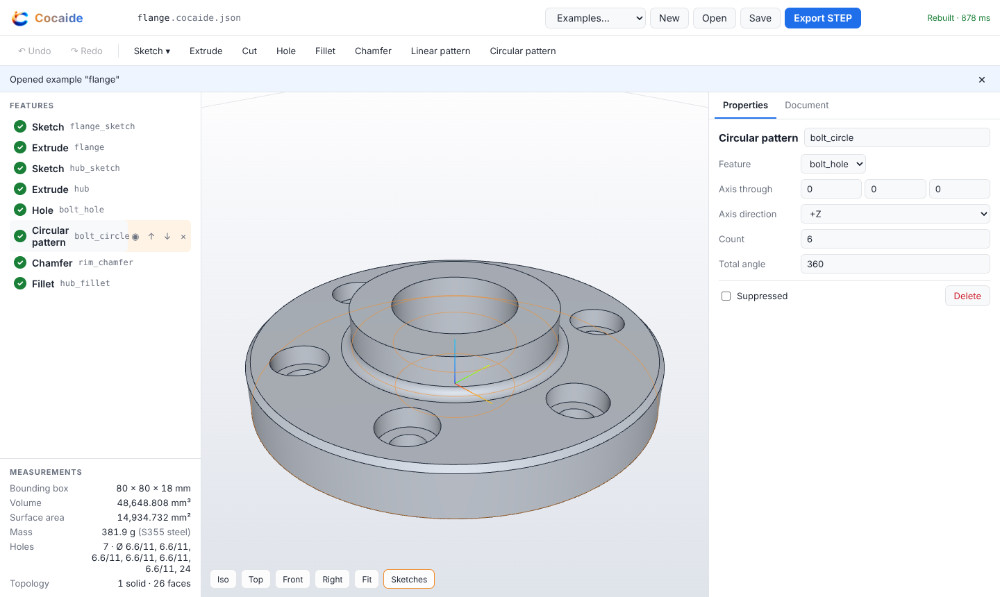
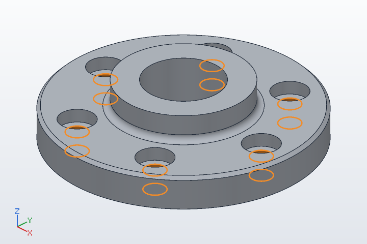
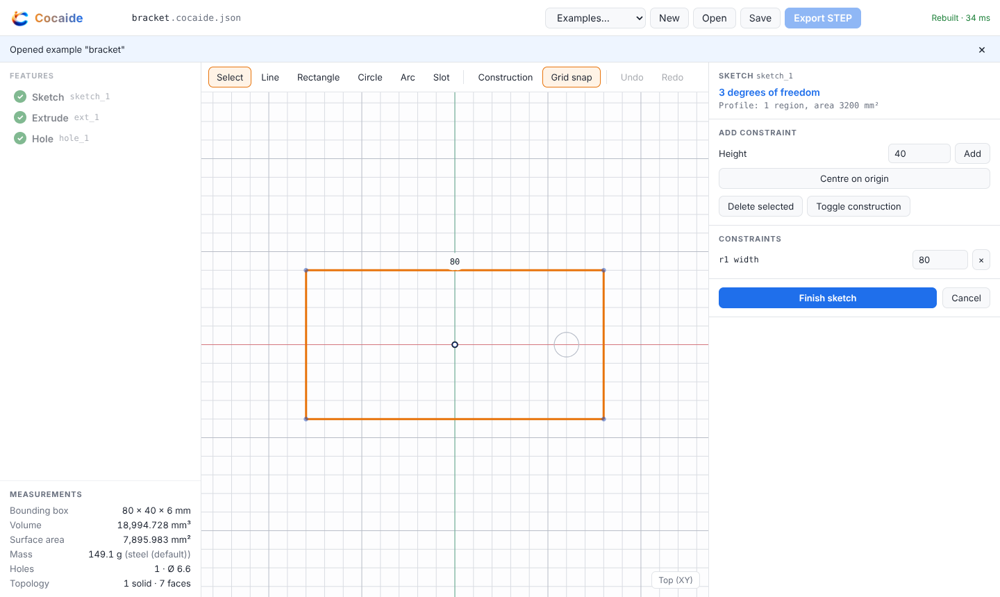

<p align="center"></p>

# Cocaide

Browser parametric CAD. One JSON feature document is the source of truth; OpenCascade (WASM, in the tab) rebuilds it into a B-rep; the mesh, the measurements and the STEP file are views of that solid. Humans and agents edit the same document, through the same commands.

**Status: Phase C (agent tools) done.**
- Phase A gave the document, the kernel, the viewport and STEP export.
- Phase B added the human modeller: a sketcher with a constraint solver, a feature tree you can reorder, suppress, edit and undo, picking in the viewport, fillet, chamfer and patterns.
- Phase C adds an MCP server: an agent edits the same document through the same commands, inside a write scope the host sets.
  - Every edit is a transaction that rolls back if it breaks the part.
  - Every call is logged next to the revision it produced, so a run can be replayed.
  - Numeric fields can be expressions over document parameters (`"=plate_t * 2"`).



## Run it

```sh
npm install
npm run dev            # http://localhost:5173
npm test               # 164 unit, kernel and agent tests, including the Phase A and Phase C acceptance suites
npm run test:e2e       # 13 browser tests (Playwright, Chromium), including the Phase B acceptance suite
npm run build          # typecheck + production bundle in dist/
```

Headless, same document and kernel as the browser:

```sh
npm run cocaide -- rebuild examples/bracket.cocaide.json          # JSON: ok, errors, features, measurements
npm run cocaide -- export-step examples/bracket.cocaide.json out/bracket.step
FREECAD_CMD=/path/to/freecadcmd npm run verify:freecad           # export every example, open each in FreeCAD, compare
FREECAD_CMD=/path/to/freecadcmd npm run verify:freecad -- out/e2e/ui-bracket.step   # open a STEP the browser exported
```

For an agent, the MCP server (stdio), and replaying what it did:

```sh
npm run -s mcp -- --doc part.cocaide.json --scope hole_1,+   # -s: npm must not print to the MCP stream
npm run replay -- part.cocaide.log.jsonl                      # re-run the logged edits, check every revision
```

## Acceptance

### Phase C: agent tools

| Check | Result |
|---|---|
| Scripted tool calls build the bracket with zero UI | A client starts the real server over stdio on a new file with scope `+`, then calls `addFeature` three times (sketch, extrude, hole). Volume 18994.728336 mm³; `validate` is clean. The file the server saved is `examples/bracket.cocaide.json` byte for byte |
| A bad diameter returns the error string and leaves the document unchanged | `updateFeature hole_1 {diameter: -2}` → `updateFeature rejected: hole_1: diameter: must be greater than 0 (got -2)`. `{diameter: 500}` is valid by the schema but breaks the part, so the transaction rolls back: `updateFeature rolled back: hole_1: removes all the material: nothing of the part would be left`. In both cases the file, the revision and the volume are unchanged |
| A tool call aimed at `ext_1` while scope is `hole_1` is rejected | `updateFeature ext_1` → `writeScope: updateFeature "ext_1" is outside the scope [hole_1]`; so are `deleteFeature ext_1` and `setParameter plate_t` (ext_1 uses it). The file is untouched, and `updateFeature hole_1` still goes through |
| The agent can add a hole, change a parameter, export STEP, take an iso screenshot | `addFeature` of a second hole; `setParameter plate_t` 6 → 10 with `ext_1.distance = "=plate_t"` (31,315.761 mm³), and `undo` back to 6. `exportSTEP` writes `bracket.step`, which OCCT reimports at the same volume and FreeCAD 26.3 opens as one valid solid named `bracket`. `screenshot iso` returns one 800×600 PNG |
| Every agent command is logged next to its revision | The JSONL log starts with the full document; replaying it reproduces every revision hash and the final file |

That suite is `tests/phase-c-acceptance.test.ts`; it drives `src/mcp/server.ts` through the MCP SDK client. The FreeCAD check runs when `FREECAD_CMD` is set. `tests/agent-session.test.ts`, `tests/scope.test.ts` and `tests/parameters.test.ts` cover the rest.



### Phase B: human modeller

| Check | Result |
|---|---|
| A human makes the bracket with no JSON editing | In the browser: New → Sketch on Top → draw a rectangle → select it, type width 80 and height 40, centre it on the origin (the sketch reads "Fully defined") → Finish → Extrude, depth 6 → click the top face → Hole, centre 30, 0, diameter 6.6. Volume 18,994.728 mm³. The document those clicks produce is the spec's bracket, the face selector included (`planar, normal +Z, pick largest`) |
| Undo returns the previous solid | Undo walks back one edit at a time (diameter, centre, the hole itself) to the 19,200 mm³ plate; redo walks forward to the bracket again |
| A bad selector shows the error, not a crash | Fillet the hole rim by clicking it, then make the hole smaller: the fillet row reads `edges: selector matched 0 edges (wanted circle edges radius 3.3 on the planar face normal +Z)`, the rest of the part still rebuilds, STEP export is refused, and undo clears it |
| The bracket built in the browser opens in FreeCAD | The STEP the **Export STEP** button downloaded opens in FreeCAD 26.3 as one valid solid named `bracket`, 18994.728336 mm³ |

These are `e2e/phase-b-acceptance.spec.ts`. `e2e/modelling.spec.ts` covers the rest: editing a sketch dimension, cancelling a sketch, line chains that close themselves, circles, arcs and slots, sketch on a face, suppress, drag-to-reorder, refused moves and deletes, fillet and chamfer by picking edges, linear and circular patterns, and the JSON tab.



### Phase A: document and kernel

| Check | Result |
|---|---|
| The spec's bracket JSON rebuilds | `examples/bracket.cocaide.json` is the spec's JSON verbatim; 3/3 features rebuild, no errors |
| Volume matches hand calc within 0.1% | 80×40×6 − π·3.3²·6 = 18994.728336 mm³; kernel gives 18994.728336 (difference below 1e-10 mm³) |
| STEP reimports | Exported STEP read back by OCCT: valid, 7 faces, same volume |
| STEP opens in FreeCAD | Every example (bracket, mounting plate, flange) opens in FreeCAD 26.3 as one valid solid; volume, area, face count and bounding box match Cocaide to 1e-6 |
| Selector survives a thickness change | Plate thickness 6 → 10 (and → 3): `hole_1`'s selector still resolves to the top face, the hole is still through, volume matches the new hand calc |

That suite is `tests/bracket.acceptance.test.ts`. FreeCAD verification is `scripts/verify-freecad.ts`; it needs a FreeCAD install, which is not a project dependency.

## Modelling in the browser

- **Sketch ▾** starts a sketch on the Top, Front or Right plane, or on a flat face you clicked. Draw with Line (clicks chain; clicking the first point closes the loop), Rectangle, Circle, Arc (centre, start, end) and Slot (two centres, then the width). Points snap to existing points, which adds a coincident constraint, or else to the grid.
- Select geometry to see the constraints that fit it, valued at what the geometry measures now; type a new value and the solver moves the sketch. Drag points, corners, circle edges or whole entities, and the solver keeps every constraint. The panel shows the degrees of freedom left and whether the profile is closed. **Finish** turns the session into one undo step.
- **Extrude** and **Cut** use the selected or latest sketch. A new cut points into the material. Click a flat face, then **Hole**: the hole is placed where you clicked. Click edges (shift-click for more), then **Fillet** or **Chamfer**. Select an extrude, cut or hole in the tree, then **Linear pattern** or **Circular pattern**.
- Picks become selectors that are checked to find exactly what was clicked. The most robust form is preferred, such as "the largest face facing +Z" or "the edge between this face and that one". Four picked corners become "straight edges parallel to +Z". Position (`near`) is used only when nothing else tells two faces or edges apart.
- In the tree, select a feature to edit it in the Properties panel. Each field commits on Enter or blur as one command. You can also suppress, move up or down, drag to reorder, and delete. Moves that break a reference are refused and the notice says why.
- Ctrl+Z / Ctrl+Shift+Z undo and redo any change to the document. Inside a sketch they undo sketch edits. The Document tab is the same document as JSON.
- **Parameters** (left panel) are named numbers. Type `=plate_t` or `=plate_t * 2 + 1` in any number field; the field shows what it evaluates to, and a bad expression is shown and not committed. Changing a parameter is one undo step, and sketches whose dimensions use it are re-solved. The sketcher works on numbers but keeps every expression whose value you did not change.

## Agents (MCP)

`src/mcp/server.ts` is an MCP server over stdio, one document per server. The host sets the document, the write scope, and where files go; the agent cannot change any of them.

```sh
tsx src/mcp/server.ts --doc part.cocaide.json   # created on the first edit if it does not exist
                      [--scope hole_1,+]         # default "*": everything
                      [--out dir]                # exports and screenshots; default the document's folder
                      [--log file.jsonl]         # default part.cocaide.log.jsonl next to the document
                      [--camera name=dx,dy,dz[/ux,uy,uz]]   # extra named views for screenshot
```

For Claude Code, for example, in `.mcp.json`:

```json
{ "mcpServers": { "cocaide": { "command": "npx", "args": ["tsx", "src/mcp/server.ts", "--doc", "parts/bracket.cocaide.json", "--scope", "hole_1,+"] } } }
```

**Tools.** Results are short JSON with `ok`, and with `error` when it failed (the MCP result is then `isError`).

| Tool | |
|---|---|
| `listFeatures`, `getFeature(id)` | The document at a glance (revision, scope, parameters, each feature's status and fields), or one feature's full JSON |
| `addFeature(feature, index?)` | `id` is optional |
| `updateFeature(id, patch)`, `deleteFeature(id)`, `reorderFeature(id, index)`, `suppressFeature(id, suppressed)` | The same commands as the UI |
| `setParameter(name, value)`, `deleteParameter(name)`, `setDimension(sketch, index, value)` | `setDimension` sets the value of constraint `index` and re-solves the sketch |
| `rebuild`, `validate` | `validate` is schema + rebuild + selector health: each selector picks exactly one thing, and is flagged if it picks by position, or if a runner-up face is within 80% of the area it chose by |
| `measure(selector?)` | The part (volume, area, bounding box, mass, holes), or what a face or edge selector picks right now |
| `exportSTEP(file?)`, `exportSTL(file?)` | Written to the output folder; refused while the part has errors |
| `screenshot(view \| direction, highlight?)` | One PNG per call. Views `iso`, `front`, `back`, `left`, `right`, `top`, `bottom`, `isoBack`, plus host-named cameras. `highlight` outlines a selector's matches, hidden ones included |
| `undo`, `redo` | The agent's own revisions |

The server's instructions say how edits work. The resource `cocaide://reference` documents every op, field and selector, and `cocaide://document` is the current file.

**Transactions.** Each edit runs `apply` (scope and schema), then a full rebuild, and is kept only if no feature newly fails. Otherwise the result is the error, and nothing changes: not the file, not the revision. A kept edit becomes a new revision, numbered and hashed (sha256 of the saved text). The file is replaced atomically.

**Write scope.** `apply(doc, cmd, { writeScope })` enforces it, so no client can get round it:
- a feature id: change, suppress, delete or move that feature, or add a feature that uses it (a pattern of it);
- `+`: add features and new parameters;
- `param:<name>`: set that parameter (also allowed when every feature that uses it is in scope);
- `name`: rename the document;
- `*`: everything.

Features the agent adds in a session are its own to keep editing.

**Log and replay.** The log is JSON Lines. It opens with a `session` entry holding the scope and the full starting document. Then there is one `call` entry per tool call: tool, arguments, ok/error, and the revision and hash after it. `npm run replay -- log.jsonl` re-runs the edits from the logged document and checks every hash. `--revision N --out file` stops at revision N and writes the document as it was.

## The document

File extension `.cocaide.json`. Units are millimetres, always. Unknown fields are errors, not ignored: `"diamter"` fails loudly.

```jsonc
{
  "version": 1,
  "units": "mm",
  "name": "bracket",
  "parameters": { "plate_t": 6 },                            // optional named numbers
  "material": { "name": "S275", "densityKgPerM3": 7850 },   // optional; default steel 7850
  "features": [ /* run in order */ ]
}
```

Any numeric field of any feature may be an expression over the parameters: `"distance": "=plate_t"`, `"center": ["=plate_w / 2 - 10", 0]`. Expressions are numbers, parameter names, `+ - * /` and parentheses, nothing else. They are evaluated before validation, so a bad one fails its feature (`hole_1: diameter: unknown parameter "hole_dia" in "=hole_dia"`).

### Operations

Every feature has an `id` and may be `"suppressed": true` (kept, but skipped by the rebuild).

| op | Fields |
|---|---|
| `sketch` | `plane: { type: "datum", normal, origin, xDir? }`, `entities[]`, `constraints[]?` |
| `extrude` / `cut` | `sketch` (id of an earlier sketch), `extent?: "blind" \| "midplane" \| "throughAll"` (default blind), `distance` (blind/midplane; midplane is the total), `direction?` (default the sketch normal) |
| `hole` | `face` (planar selector, must match exactly one face), `center: [x, y]`, `diameter`, `depth: number \| "through"`, optional `counterbore: { diameter, depth }` or `countersink: { diameter, angle }` |
| `fillet` / `chamfer` | `edges` (one edge selector, or a list whose matches are combined), `radius` / `distance` |
| `linearPattern` | `feature` (an earlier extrude, cut or hole), `direction`, `spacing`, `count` (including the original); optional `direction2`, `spacing2`, `count2` for a grid |
| `circularPattern` | `feature`, `axis: { origin, direction }`, `count` (including the original), `angle?` (total sweep, default 360) |

A pattern repeats the seed feature's tool body. An instance that adds or removes no material is an error that names the instance (`instance 5 (offset [-80, 0, 0]) removes no material`).

Sketch entities: `line {start, end}`, `circle {center, radius}`, `arc {center, start, end, clockwise?}` (counter-clockwise by default), `rect {center, w, h}`, `slot {center1, center2, width}`. Any entity can be `"construction": true`. Closed loops are found by chaining endpoints. A loop inside a loop is a hole, and a loop inside that is an island. Loops must not cross or touch.

Constraints: `coincident {points: ["l1.end", "a1.start"]}` (a point may be `"origin"`), `horizontal`/`vertical {entity}`, `distance`/`distanceX`/`distanceY {entity | points, value}`, `radius {entity, value}`, `equal {entities: [a, b]}`.
- **In the sketcher, constraints are solved:** typing a value drives the geometry.
- **In the rebuild, they are only checked:** the document stores solved geometry, and a constraint that doesn't hold (for example, after hand-editing the JSON) fails the sketch with the measured value.

### Plane frames

A sketch's 2D axes come from its plane normal: x is `xDir` if given, else global X projected onto the plane (global Y if the normal is parallel to X), and y = normal × x. A hole's `center` uses the same rule on the selected face's plane, with the origin at the global origin projected onto that plane. So on a +Z face, `[30, 0]` means x = 30, y = 0; on a −Z face the y axis points to −Y. The Front plane is normal −Y, so its sketch x is +X and its y is +Z.

### Selectors

Faces and edges are chosen by query, re-run on every rebuild. Topology indexes are never stored.

```jsonc
{ "type": "planar", "normal": [0, 0, 1], "pick": "largest", "offset": 6 }       // offset optional
{ "type": "cylindrical", "radius": 3.3, "axis": [0, 0, 1], "pick": "all" }      // radius, axis optional
{ "type": "edge", "kind": "line", "direction": [0, 0, 1], "pick": "all" }       // the vertical corners
{ "type": "edge", "between": [<face selector>, <face selector>], "pick": "all" } // the edge two faces share
{ "type": "edge", "kind": "circle", "radius": 3.3, "onFace": <face selector>, "pick": "all" }
```

- **Face `pick`:** `largest`, `smallest` or `all`.
- **Edge `pick`:** `all`, `longest` or `shortest`.
- **Edge filters:** `kind` (`line`, `circle`, `other`), `direction`, `radius`, `length`, `onFace`, `between`.
- **`near: [x, y, z]`:** any selector may add this. It keeps the match whose centre is closest to that point, for faces or edges that are otherwise identical.

A selector that matches the wrong number of faces fails, including a tie. It never guesses. Hole seams (where a cylinder's surface closes on itself) are never selected.

### Rebuild contract

`rebuild(doc) → { ok, solid, measurements, errors[], features[] }`. Features run in order. A failed feature adds nothing and the rebuild carries on, so one bad hole doesn't hide the rest of the part. Every error names its feature:

```
hole_1: selector matched 0 faces (wanted 1 planar face normal +Z)
hole_1: center [130, 0] is not on the selected face (it is 90 mm outside it)
fillet_1: edges: selector matched 0 edges (wanted circle edges radius 3.3 on the planar face normal +Z)
ext_1: sketch "sketch_1" is suppressed, so there is no profile to extrude
sketch_1: profile is open at [0, 0] (start of "l1")
```

Every operation is verified before it is accepted: the result must be a valid solid, and it must actually have added or removed material. `measurements` is read from the B-rep: bounding box, volume, surface area, hole count and diameters, and mass at the document's density. A hole is a run of full concave coaxial cylinders, so slot ends and fillets don't count. STEP export is refused while the rebuild has errors.

### Commands and undo

Every edit goes through `apply(doc, command, { writeScope? })` (`src/doc/commands.ts`). The commands are:
- `addFeature`, `updateFeature` (where `null` removes a field), `replaceFeature`, `deleteFeature`, `reorderFeature`, `suppressFeature`, `setName`;
- `setParameter`, `deleteParameter`;
- `setDimension`, which changes a sketch constraint's value and re-solves the sketch.

When a parameter or dimension changes, the sketches it affects are re-solved. Fields that are expressions are held fixed, and only plain numbers move. `apply` never mutates its input. It refuses an edit that falls outside the write scope, would introduce a validation error, would delete a feature something uses, or would move a feature above one it uses, and it says why. Undo is a stack of document snapshots (`src/doc/history.ts`); restoring the document restores the solid. The UI and the agent session are both clients of `apply`.

## Layout

```
src/doc       document types, strict validation, parameters, formatting, commands, write scope, undo history   (no kernel)
src/geom      plane frames, 2D profiles, constraint checks, the constraint solver     (no kernel)
src/kernel    OCCT: operations, selectors, picking -> selector synthesis, measurements, mesh, STEP, rebuild()
src/worker    the kernel in a Web Worker; meshes, topology and STEP text cross the boundary, shapes never do
src/agent     the agent session (Node): transactions, revisions, log, replay, selector health
src/render    software renderer (PNG screenshots without a GPU) and binary STL
src/mcp       the MCP server and the reference it serves
src/ui        React + Three.js: viewport with picking, feature tree, properties, measurements, JSON tab
src/ui/sketcher  the 2D sketcher: canvas, tools, constraint panel
scripts       headless CLI, FreeCAD verification, log replay
examples      bracket (the spec's JSON), mounting plate (every Phase A op), flange (patterns, chamfer, fillet)
tests         unit, kernel, agent and MCP tests (Vitest, Node)
e2e           browser tests (Playwright)
```

The kernel is `replicad-opencascadejs` (OCCT 8.0 compiled to WASM), called directly. The `replicad` modelling API is not used.

## Notes

- **WASM heap growth.** The OCCT WASM build never returns the memory of deleted B-rep topology, while native OCCT does. Measured: a box created and deleted 30 000 times grows the WASM heap by about 290 MB, and FreeCAD's native OCCT doesn't grow at all. Older `replicad-opencascadejs` releases behave the same.
  - A rebuild costs about 0.3 MB (bracket) to 4 MB (mounting plate).
  - The kernel holds nothing the document doesn't, so the worker swaps in a fresh OCCT instance (about 250 ms) once the heap passes 1 GB (`RECYCLE_HEAP_BYTES`, `recycleOC()`).
  - The MCP server's session does the same after any call that leaves the heap past that size.
- **Where documents live.** The working document is kept in `localStorage` between reloads. Open and Save use `.cocaide.json` files, and you can also drop a file on the window.
- **Test hook.** `?e2e` in the URL exposes `window.__cocaideViewport.project([x, y, z])`, which the browser tests use to click a known face or edge.
