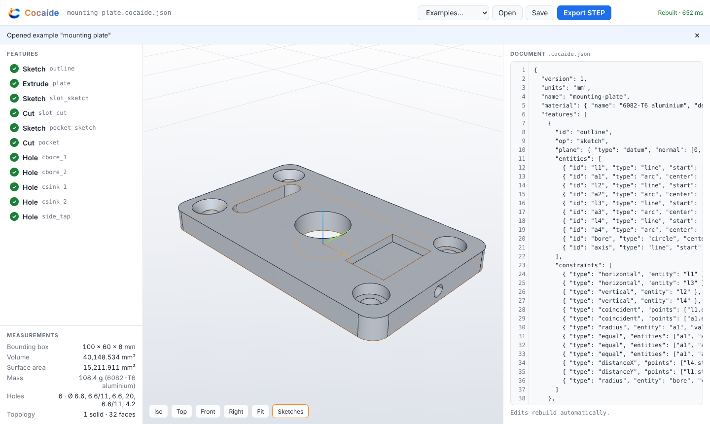
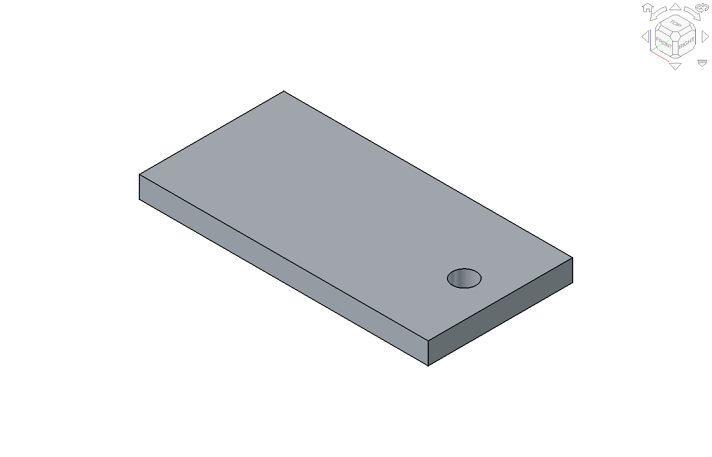

<p align="center"></p>

# Cocaide

Browser parametric CAD. One JSON feature document is the source of truth; OpenCascade (WASM, in the tab) rebuilds it into a B-rep; the mesh, the measurements and the STEP file are views of that solid. Humans and agents edit the same document.

**Status: Phase A (document and kernel, no AI).** `.cocaide.json` load/save, sketch / extrude / cut / hole, an orbiting viewport, STEP export. Phase B (human modeller) has not been started.



## Run it

```sh
npm install
npm run dev            # http://localhost:5173
npm test               # 53 tests, includes the Phase A acceptance suite
npm run build          # typecheck + production bundle in dist/
```

Headless, same document and kernel as the browser:

```sh
npm run cocaide -- rebuild examples/bracket.cocaide.json          # JSON: ok, errors, features, measurements
npm run cocaide -- export-step examples/bracket.cocaide.json out/bracket.step
FREECAD_CMD=/path/to/freecadcmd npm run verify:freecad           # export every example, open each in FreeCAD, compare
```

## Phase A acceptance

| Check | Result |
|---|---|
| The spec's bracket JSON rebuilds | `examples/bracket.cocaide.json` is the spec's JSON verbatim; 3/3 features rebuild, no errors |
| Volume matches hand calc within 0.1% | 80×40×6 − π·3.3²·6 = 18994.728336 mm³; kernel gives 18994.728336 (difference below 1e-10 mm³) |
| STEP reimports | Exported STEP read back by OCCT: valid, 7 faces, same volume |
| STEP opens in FreeCAD | FreeCAD 26.3 imports one valid solid named `bracket`; volume, area, face count and bounding box match Cocaide to 1e-6. Checked for both examples, for the 10 mm variant, and for the file the browser's **Export STEP** button downloaded |
| Selector survives a thickness change | Plate thickness 6 → 10 (and → 3): `hole_1`'s selector still resolves to the top face, the hole is still through, volume matches the new hand calc |

The acceptance suite is `tests/bracket.acceptance.test.ts`; FreeCAD verification is `scripts/verify-freecad.ts` (it needs a FreeCAD install, which is not a project dependency).



## The document

File extension `.cocaide.json`. Units are millimetres, always. Unknown fields are errors, not ignored: `"diamter"` fails loudly.

```jsonc
{
  "version": 1,
  "units": "mm",
  "name": "bracket",
  "material": { "name": "S275", "densityKgPerM3": 7850 },   // optional; default steel 7850
  "features": [ /* run in order */ ]
}
```

### Operations

| op | Fields |
|---|---|
| `sketch` | `plane: { type: "datum", normal, origin, xDir? }`, `entities[]`, `constraints[]?` |
| `extrude` / `cut` | `sketch` (id of an earlier sketch), `extent?: "blind" \| "midplane" \| "throughAll"` (default blind), `distance` (blind/midplane; midplane is the total), `direction?` (default the sketch normal) |
| `hole` | `face` (planar selector, must match exactly one face), `center: [x, y]`, `diameter`, `depth: number \| "through"`, optional `counterbore: { diameter, depth }` or `countersink: { diameter, angle }` |

Sketch entities: `line {start, end}`, `circle {center, radius}`, `arc {center, start, end, clockwise?}` (counter-clockwise by default), `rect {center, w, h}`, `slot {center1, center2, width}`. Any entity can be `"construction": true`. Closed loops are found by chaining endpoints; a loop inside a loop is a hole, a loop inside that is an island. Loops must not cross or touch.

Constraints: `coincident {points: ["l1.end", "a1.start"]}`, `horizontal`/`vertical {entity}`, `distance`/`distanceX`/`distanceY {entity | points, value}`, `radius {entity, value}`, `equal {entities: [a, b]}`. **In Phase A constraints are checked, not solved**: the geometry in the document is authoritative, and a constraint that does not hold fails the sketch with the measured value. The solver that drives geometry from constraints is Phase B work.

### Plane frames

A sketch's 2D axes come from its plane normal: x is `xDir` if given, else global X projected onto the plane (global Y if the normal is parallel to X), and y = normal × x. A hole's `center` uses the same rule on the selected face's plane, with the origin at the global origin projected onto that plane. So on a +Z face, `[30, 0]` means x = 30, y = 0; on a −Z face the y axis points to −Y.

### Selectors

Faces are chosen by query, re-run on every rebuild. Topology indexes are never stored.

```jsonc
{ "type": "planar", "normal": [0, 0, 1], "pick": "largest", "offset": 6 }   // offset optional
{ "type": "cylindrical", "radius": 3.3, "axis": [0, 0, 1], "pick": "all" }  // radius, axis optional
```

`pick` is `largest`, `smallest` or `all`. A selector that matches the wrong number of faces fails, including a tie for largest. It never guesses.

### Rebuild contract

`rebuild(doc) → { ok, solid, measurements, errors[], features[] }`. Features run in order. A failed feature adds nothing and the rebuild carries on, so one bad hole does not hide the rest of the part. Every error names its feature:

```
hole_1: selector matched 0 faces (wanted 1 planar face normal +Z)
hole_1: center [130, 0] is not on the selected face (it is 90 mm outside it)
cut_1: removed no material: the cut does not reach the solid in direction +Z; check direction and distance, or use extent throughAll
sketch_1: profile is open at [0, 0] (start of "l1")
```

Every operation is verified before it is accepted: the result must be a valid solid, and it must actually have added or removed material. `measurements` is read from the B-rep: bounding box, volume, surface area, hole count and diameters (a hole is a run of full concave coaxial cylinders, so slot ends and fillets do not count), and mass at the document's density. STEP export is refused while the rebuild has errors.

## Layout

```
src/doc      document types, strict validation, load/save formatting   (no kernel)
src/geom     plane frames, 2D profile building, constraint checks      (no kernel)
src/kernel   OCCT: operations, selectors, measurements, mesh, STEP, rebuild()
src/worker   the kernel in a Web Worker; meshes and STEP text cross the boundary, shapes never do
src/ui       React + Three.js: viewport, feature list, measurements, document editor
scripts      headless CLI and FreeCAD verification
examples     bracket (the spec's JSON) and a mounting plate that uses every Phase A operation
```

The kernel is `replicad-opencascadejs` (OCCT 8.0 compiled to WASM), called directly. The `replicad` modelling API is not used.

## Notes

- **WASM heap growth.** The OCCT WASM build never returns the memory of deleted B-rep topology, while native OCCT does. Measured: a box created and deleted 30 000 times grows the WASM heap by about 290 MB, and FreeCAD's native OCCT does not grow at all; older `replicad-opencascadejs` releases behave the same. A rebuild costs about 0.3 MB (bracket) to 4 MB (mounting plate). The kernel holds nothing the document does not, so the worker swaps in a fresh OCCT instance (about 250 ms) once the heap passes 1 GB (`RECYCLE_HEAP_BYTES`, `recycleOC()`). A long-running Node host, such as the Phase C MCP server, should do the same.
- The working document is kept in `localStorage` between reloads. Open and Save use `.cocaide.json` files, and you can also drop a file on the window.
- Hovering a face in the viewport shows its type, outward normal, plane offset and area: what you need to write a selector by hand until Phase B adds picking.
